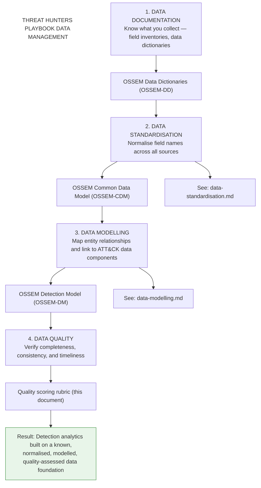
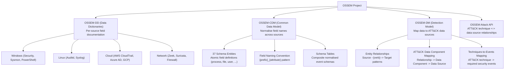

# 02 — Data Documentation

> **MITRE SOC Strategy Addressed:**
> - Strategy 7: Select and Collect the Right Data

---

## Purpose

Data documentation is the prerequisite for every detection, hunt, and investigation in the SOC. If you cannot describe what your data looks like, you cannot write reliable analytics against it.

The Threat Hunters Playbook defines **four data management disciplines** that must be established before any hunt or detection can succeed. This module implements all four as a progression:



### Module Directory

```
02-Data-Documentation/
├── README.md                  ← This file (documentation + quality + gap analysis)
├── data-standardisation.md    ← OSSEM-CDM field normalisation guide
└── data-modelling.md          ← OSSEM-DM entity relationship modelling guide
```

### Framework Integration

| Project | Sub-Project | Role in This Module |
|---|---|---|
| **OSSEM** | **OSSEM-DD** (Data Dictionaries) | Per-source field documentation |
| **OSSEM** | **OSSEM-CDM** (Common Data Model) | Cross-source field normalisation using 37 entity schemas |
| **OSSEM** | **OSSEM-DM** (Detection Model) | Entity relationship mapping and ATT&CK data component linkage |
| **Threat Hunters Playbook** | Pre-Hunt methodology | Defines the four-discipline data management approach |
| **Threat Hunters Playbook** | Hunt notebooks | Data-driven hunt hypotheses linked to specific data sources and ATT&CK techniques |
| **Security Datasets (Mordor)** | Validation data | Pre-recorded security events for analytic testing |

---

## Discipline 1 — Data Documentation (OSSEM-DD)

### What is OSSEM?

OSSEM provides a common information model and data dictionaries for security events across platforms (Windows, Linux, macOS, cloud). It answers the question: *"What fields does this event actually contain, and what do they mean?"*

### OSSEM Components Used in This Pipeline



### Data Source Inventory Template

Before writing any detection, catalog what data you actually have. Use this template per source:

```markdown
## Data Source: [Source Name]

### Metadata
- **Platform:** Windows / Linux / Cloud / Network
- **Log Source:** Sysmon / Windows Security / Auditd / CloudTrail / etc.
- **Collection Method:** Agent / WEF / Syslog / API
- **SIEM Index:** [index name]
- **Retention Period:** [days]
- **Volume:** [estimated EPS]

### OSSEM Mapping
- **OSSEM Data Dictionary:** [link to OSSEM-DD entry]
- **CDM Entity:** [process, file, network, registry, user, etc.]
- **Key Fields:**

| OSSEM CIM Field | Raw Field Name | Description |
|---|---|---|
| src_ip_addr | SourceAddress | Source IP of the connection |
| dst_ip_addr | DestinationAddress | Destination IP |
| process_name | Image | Full path of the executing process |
| process_command_line | CommandLine | Full command line arguments |
| user_name | SubjectUserName | Account that performed the action |

### ATT&CK Data Source Mapping
- **ATT&CK Data Source:** [e.g., DS0009 - Process]
- **Data Component:** [e.g., Process Creation]
- **Techniques Coverable:** [T1059, T1053, T1547, ...]

### Entity Relationships Supported
- **Relationships observable from this source** (from data-modelling.md):

| Relationship | CDM Fields Required |
|---|---|
| Process created Process | process_name, process_parent_name, process_id |
| User executed Command | user_name, process_command_line |

### Quality Assessment
- [ ] Events arriving consistently (no gaps > 15 min)
- [ ] Key fields are populated (not null/empty)
- [ ] Timestamps are normalised to UTC
- [ ] Field parsing validated against OSSEM CDM naming convention
- [ ] Entity relationships from this source are documented
- [ ] Volume baseline established
```

---

## Discipline 2 — Data Standardisation (OSSEM-CDM)

> **Full guide:** [data-standardisation.md](data-standardisation.md)

Data standardisation normalises field names across all sources using the OSSEM Common Data Model. Without it, every analytic must account for vendor-specific field names — limiting portability and increasing maintenance burden.

### Summary

The CDM operates across three levels:

| Level | Component | Purpose |
|---|---|---|
| **1** | 37 Schema Entities | Define atomic field attributes (process, file, user, network, etc.) |
| **2** | `{prefix}_{attribute}` naming | Deterministic field name construction |
| **3** | Schema Tables | Composite normalised schemas grouping entities by event category |

### Quick Example

| Concept | Sysmon Raw | Security Raw | CDM Normalised |
|---|---|---|---|
| Process name | `Image` | `NewProcessName` | `process_name` |
| Parent process | `ParentImage` | `ParentProcessName` | `process_parent_name` |
| Command line | `CommandLine` | `CommandLine` | `process_command_line` |
| User | `User` | `SubjectUserName` | `user_name` |
| Source IP | `SourceIp` | `IpAddress` | `src_ip_addr` |

Once normalised, a single analytic query works across all sources:

```sql
SELECT process_parent_name, process_name, process_command_line
FROM process_creation
WHERE process_name LIKE '%powershell%'
  AND process_parent_name LIKE '%winword%'
```

See [data-standardisation.md](data-standardisation.md) for the full entity catalog, naming convention rules, schema table definitions, raw-to-CDM mapping templates, and SIEM-specific implementation guidance.

---

## Discipline 3 — Data Modelling (OSSEM-DM)

> **Full guide:** [data-modelling.md](data-modelling.md)

Data modelling maps the **relationships between entities** that security events describe. An adversary's actions are chains of entity interactions — data modelling makes those chains queryable.

### Summary

The Detection Model uses a `Source → Verb → Target` pattern:

```
Process ──created──▶ Process       (process execution)
Process ──connected to──▶ IP      (network activity)
User ──authenticated to──▶ Host   (logon events)
Process ──accessed──▶ File         (file access)
Process ──modified──▶ Registry     (persistence)
```

Each relationship maps to:
1. **ATT&CK Data Components** — which techniques require this relationship
2. **Security Events** — which event IDs provide evidence of this relationship
3. **CDM Fields** — which normalised fields to query

### The ATT&CK Mapping Chain

```
ATT&CK Technique
  └──▶ Data Source (e.g., Process)
         └──▶ Data Component (e.g., Process Creation)
                └──▶ Relationship (e.g., Process created Process)
                        └──▶ Security Events (e.g., Sysmon 1, Security 4688)
                                └──▶ CDM Fields (e.g., process_name, process_command_line)
```

This chain is the bridge between *"what technique do I need to detect?"* (Module 03) and *"what specific data do I need?"* (this module).

See [data-modelling.md](data-modelling.md) for the full relationship catalog, YAML structure, ATT&CK data source mapping methodology, and gap analysis templates.

---

## Discipline 4 — Data Quality

### Quality Scoring Rubric

Use this rubric to assess each data source before writing detections against it:

| Score | Level | Criteria |
|---|---|---|
| **5** | Production-Ready | Consistent ingestion, CDM-normalised, validated fields, entity relationships mapped, baselined volume |
| **4** | Reliable | Consistent ingestion, most fields parsed and normalised, minor gaps in relationship coverage |
| **3** | Usable | Ingested but CDM mapping incomplete or occasional gaps; basic relationships documented |
| **2** | Partial | Intermittent collection, significant field issues, no standardisation applied |
| **1** | Experimental | Ad-hoc collection, untested parsing, raw vendor field names only |
| **0** | Not Collected | Data source identified but not onboarded |

**Rule:** Only write production detections against data scored 4 or 5. Score 3 data can support hunting hypotheses. Below 3, prioritise data onboarding before detection work.

### Quality Dimensions

The Threat Hunters Playbook references the DoD Core Set of Data Quality Requirements. Assess at minimum:

| Dimension | Assessment Question | Measurement |
|---|---|---|
| **Completeness** | Are all expected fields populated? Are all expected events collected? | % of fields non-null; event count vs expected baseline |
| **Consistency** | Are field names and values consistent across sources after CDM normalisation? | Cross-source query results match for same activity |
| **Timeliness** | Are events arriving within an acceptable time window? | Max ingestion latency; gap detection threshold (e.g., 15 min) |

### Hunt-Readiness Score

Following Roberto Rodriguez's "Ready to Hunt?" methodology, calculate an overall readiness score:

```
Hunt-Readiness Score = Average(Data Quality, Talent, Technology)

Data Quality  = Average quality score across priority data sources (0-5 scale)
Talent        = Analyst skill level for the hunt technique (from workforce-roles.md)
Technology    = Tool capability for the required analytics (SIEM, notebook, etc.)
```

A score below 3.0 in any dimension means the hunt is not ready — address the weakest area first.

---

## Threat Hunters Playbook Integration

### What is the Threat Hunters Playbook?

The Threat Hunters Playbook by the Open Threat Research (OTR) community provides Jupyter notebook-based hunt playbooks. Each playbook documents:

- The **ATT&CK technique** being hunted
- The **hypothesis** (what adversary behaviour looks like in data)
- The **required data sources** (mapped to OSSEM)
- The **required entity relationships** (from OSSEM-DM)
- The **analytics** (queries using CDM-normalised field names)
- **Validation datasets** (pre-built datasets from Security Datasets / Mordor project)

### How It Feeds the Pipeline

```mermaid
flowchart TD
    THP["Threat Hunters Playbook"]

    M02["Module 02 (This Module)"]
    M03["Module 03 (Threat Intelligence)"]
    M04["Module 04 (Detection Engineering)"]
    M07["Module 07 (Detection Testing)"]

    THP --> M02
    THP --> M03
    THP --> M04
    THP --> M07

    M02 --> M02a["Data documentation requirements per technique"]
    M02 --> M02b["Data standardisation methodology (CDM approach)"]
    M02 --> M02c["Data modelling patterns (entity relationships)"]
    M02 --> M02d["Data quality requirements for hunt-readiness"]

    M03 --> M03a["ATT&CK technique prioritisation"]
    M03 --> M03b["Adversary behaviour patterns"]

    M04 --> M04a["Pre-built analytics as detection starting points"]
    M04 --> M04b["Query templates using CDM field names\n(Sigma, KQL, SPL)"]
    M04 --> M04c["Entity relationship-based detection logic"]

    M07 --> M07a["Security Datasets (Mordor) for offline testing"]
    M07 --> M07b["Simulation procedures for live testing"]
    M07 --> M07c["Validation of entity relationship observability"]
```



### Playbook-Driven Data Gap Analysis

Use the Threat Hunters Playbook to identify what data your SOC is missing:

1. **Select priority ATT&CK techniques** from Module 03 threat profile
2. **Find corresponding playbooks** in the Threat Hunters Playbook
3. **Extract required data sources** and **entity relationships** from each playbook
4. **Compare against your data source inventory** and **relationship coverage**
5. **Score each gap**:

| Technique | Required Relationship | Required Events | CDM Mapped? | Quality Score | Gap Action |
|---|---|---|---|---|---|
| T1059.001 (PowerShell) | Process created Process | Sysmon 1 | Yes | 5 | None — fully operational |
| T1059.001 (PowerShell) | Process executed Script | PowerShell 4104 | No | 0 | Enable Script Block Logging, create CDM mapping |
| T1053.005 (Sched. Task) | User created Scheduled Job | Security 4698 | Partial | 3 | Complete CDM field mapping |
| T1071.001 (Web Protocols) | Process connected to IP | Zeek conn.log | No | 2 | Fix collection gaps, apply CDM normalisation |

---

## Complete Data Management Workflow

### Step-by-Step Process

```mermaid
flowchart LR
    S1["1. INVENTORY\nList all log sources\ncurrently collected"]
    S2["2. DOCUMENT\nMap each source to\nOSSEM Data Dictionaries (DD)"]
    S3["3. STANDARDISE\nApply OSSEM CDM\n{prefix}_{attr} naming convention"]
    S4["4. MODEL\nMap entity relationships\n(Source->Verb->Target)"]
    S5["5. VALIDATE\nScore quality per\ndata source (Disciplines 1-4)"]
    S6["6. GAP ANALYSIS\nCompare to TH Playbook\nrequired relationships"]
    S7["7. PRIORITISE\nRank gaps by ATT&CK\ntechnique priority (Mod 03)"]
    S8["8. ONBOARD\nDeploy collection for\nnew sources and standardise"]
    S9["9. BASELINE\nEstablish volume\nand field baselines"]
    S10["10. INTEGRATE\nFeed CDM mappings and\nrelationship model to Mod 04"]
    S11["11. REVIEW\nSchedule quarterly data\nquality and relationship reviews"]

    S1 --> S2 --> S3 --> S4
    S4 --> S5 --> S6 --> S7 --> S8
    S8 --> S9 --> S10 --> S11
```



### Data Source Priority Matrix

Cross-reference data source value against collection cost:

```mermaid
quadrantChart
    title Data Source Priority Matrix
    x-axis Low Cost --> High Cost
    y-axis Low Value --> High Value
    quadrant-1 High Value / High Cost
    quadrant-2 High Value / Low Cost
    quadrant-3 Low Value / Low Cost
    quadrant-4 Low Value / High Cost
    Process Creation (Sysmon 1): [0.25, 0.95]
    PowerShell Script Block Logging: [0.30, 0.90]
    DNS Query Logs: [0.20, 0.85]
    Authentication Events: [0.15, 0.80]
    Network Connection (Sysmon 3 / Zeek): [0.35, 0.75]
    File Creation (Sysmon 11): [0.30, 0.70]
    Registry Modification (Sysmon 13): [0.45, 0.55]
    WMI Events (Sysmon 19-21): [0.50, 0.50]
    Cloud API Calls (CloudTrail, AzureAD): [0.65, 0.55]
    Email Gateway Logs: [0.60, 0.45]
    Image Load (Sysmon 7): [0.55, 0.30]
    Raw Named Pipe (Sysmon 17-18): [0.65, 0.25]
    Driver Load (Sysmon 6): [0.50, 0.20]
    Full Packet Capture: [0.85, 0.15]
```

Prioritise the upper-left quadrant: high detection value, lower collection cost.

---

## Inputs

| Input | Source Module | Description |
|---|---|---|
| Crown Jewel Asset Inventory | [01 Governance](../01-Governance/) | Prioritised asset list determining which systems require log collection |
| SOC Charter & Scope | [01 Governance](../01-Governance/) | In-scope environments and data classification boundaries |
| Data Source Requirements (ATT&CK) | [03 Threat Intelligence](../03-Threat-Intelligence/) | ATT&CK data sources required to detect priority techniques |
| Detection Data Requirements | [04 Detection Engineering](../04-Detection-Engineering/) | Specific fields and event types required by Sigma rules and DeTTECT |
| Data Source Gap Findings | [08 Forensics & DFIR](../08-Forensics-DFIR/) | Missing log sources discovered during forensic investigations |
| Threat Hunters Playbook | External Framework | Data requirements per hunt hypothesis (OSSEM-DD/CDM/DM patterns) |

---

## Outputs

| Output | Consumers | Description |
|---|---|---|
| Data Source Inventory | All modules | Complete catalog of available security data sources |
| OSSEM-DD Data Dictionaries | Module 02 (internal) | Per-source field documentation in YAML |
| OSSEM-CDM Mapping | Module 04 (Detection) | Normalised field name reference for all analytics |
| OSSEM-DM Relationship Map | Modules 03, 04, 05 | Entity relationship coverage showing what interactions are observable |
| Data Quality Scorecards | Module 04, 07 | Per-source quality ratings across completeness, consistency, timeliness |
| Data Gap Analysis | Module 01 (Governance), Module 04 | Missing data sources and relationships mapped to ATT&CK techniques |
| Data Onboarding Backlog | SOC Engineering | Prioritised list of data sources to collect, standardise, and model |

---

## Implementation Checklist

### Documentation (Discipline 1)
- [ ] Enumerate all currently collected log sources
- [ ] Create OSSEM-DD format data dictionary entry for each source

### Standardisation (Discipline 2)
- [ ] Map raw field names to OSSEM CDM standard fields (`{prefix}_{attribute}`)
- [ ] Configure SIEM parsing to apply CDM normalisation at ingest/search time
- [ ] Validate cross-source queries return consistent results using CDM field names

### Modelling (Discipline 3)
- [ ] Identify priority ATT&CK techniques from Module 03 threat profile
- [ ] Map required entity relationships for each priority technique
- [ ] Document which relationships are observable from current data sources
- [ ] Identify relationship gaps and remediation actions

### Quality (Discipline 4)
- [ ] Score each data source using the quality rubric (0-5)
- [ ] Assess completeness, consistency, and timeliness per source
- [ ] Calculate hunt-readiness scores for priority techniques

### Gap Analysis and Onboarding
- [ ] Download Threat Hunters Playbook and extract data requirements
- [ ] Run gap analysis: required relationships vs. observable relationships
- [ ] Prioritise gaps using the value/cost matrix
- [ ] Create onboarding tickets for high-priority missing sources
- [ ] Establish volume baselines for anomaly detection
- [ ] Schedule quarterly data quality and relationship coverage reviews

---

## References

- [OSSEM Project](https://github.com/OTRF/OSSEM)
- [OSSEM Common Data Model (CDM)](https://github.com/OTRF/OSSEM-CDM)
- [OSSEM Data Dictionaries (DD)](https://github.com/OTRF/OSSEM-DD)
- [OSSEM Detection Model (DM)](https://github.com/OTRF/OSSEM-DM)
- [Threat Hunters Playbook](https://github.com/OTRF/ThreatHunter-Playbook)
- [Threat Hunters Playbook — Data Management](https://threathunterplaybook.com/pre-hunt/data_management.html)
- [Security Datasets (Mordor)](https://github.com/OTRF/Security-Datasets)
- [ATT&CK Data Sources](https://attack.mitre.org/datasources/)
- [MITRE 11 Strategies — Strategy 7](https://www.mitre.org/sites/default/files/2022-04/11-strategies-of-a-world-class-cybersecurity-operations-center.pdf)
- [Ready to Hunt? First, Show Me Your Data! — Roberto Rodriguez](https://posts.specterops.io/ready-to-hunt-first-show-me-your-data-a642c6b170d6)
