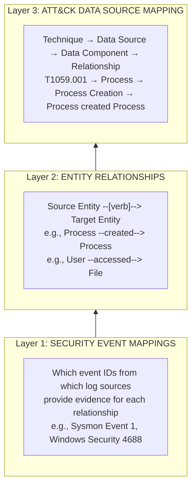
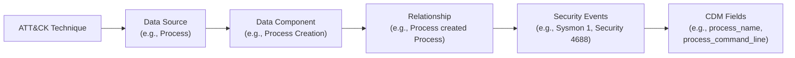
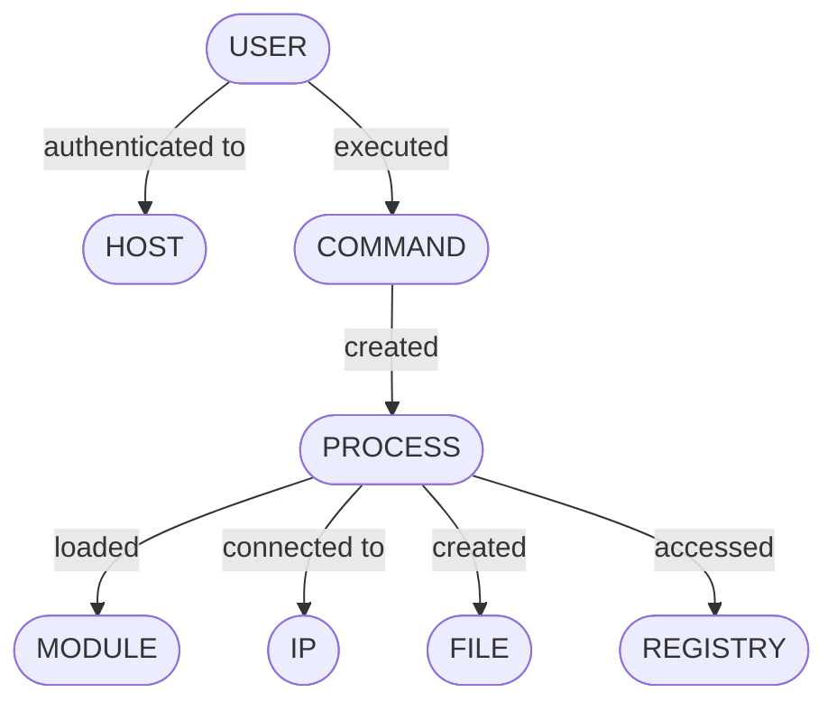

# Data Modelling

> **Foundation:** [OSSEM Detection Model (DM)](https://github.com/OTRF/OSSEM-DM)
> **Source Methodology:** [Threat Hunters Playbook — Pre-Hunt: Data Modelling](https://threathunterplaybook.com/pre-hunt/data_modelling.html)

---

## Why Model Security Data?

Data standardisation (covered in [data-standardisation.md](data-standardisation.md)) normalises field names across sources. Data modelling goes further — it maps the **relationships between entities** that security events describe.

An adversary's actions are not isolated events. They are chains of entity interactions:

```
User  ──authenticated to──▶  Host
User  ──executed──▶  Process (cmd.exe)
Process (cmd.exe)  ──created──▶  Process (whoami.exe)
Process (whoami.exe)  ──accessed──▶  Token (local user enumeration)
Process (cmd.exe)  ──created──▶  File (payload.exe)
Process (payload.exe)  ──connected to──▶  IP (C2 server)
```

Without a data model, these are disconnected log lines. With one, they become a traceable attack chain. Data modelling defines these entity relationships so that analytics can be written to detect adversary behaviour patterns, not just individual events.

> *"A data model basically determines the structure of data and the relationships identified among each other. Identifying relationships among security events is very important to document specific events that could map to specific chain of events related to adversaries' behaviours."*
> — Threat Hunters Playbook

---

## OSSEM Detection Model (DM) Architecture

The Detection Model uses a **Source → Relationship → Target** pattern to define every meaningful interaction between security entities.



---

## Layer 1 — Security Event Mappings

Each relationship maps to the specific events that provide evidence of that interaction occurring.

### Event Mapping Structure

```yaml
security_events:
  - event_id: 4688
    name: "A new process has been created"
    platform: Windows
    log_source: Microsoft-Windows-Security-Auditing
    audit_category: Detailed Tracking
    audit_sub_category: Process Creation
    channel: Security
    filter_in: {}
  - event_id: 1
    name: "Process creation"
    platform: Windows
    log_source: Microsoft-Windows-Sysmon
    channel: Microsoft-Windows-Sysmon/Operational
    filter_in: {}
  - event_id: execve
    name: "Program execution"
    platform: Linux
    log_source: auditd
    channel: audit.log
    filter_in:
      type: SYSCALL
```

This mapping answers the question: *"Which logs do I need to be collecting to observe this relationship?"*

---

## Layer 2 — Entity Relationships

Relationships define **who does what to whom** in security telemetry, using a consistent `Source → Verb → Target` pattern.

### Relationship YAML Structure

```yaml
relationship_id: REL-2022-0001
name: Process created Process
contributors:
  - Jose Rodriguez @Cyb3rPandaH
references:
  - https://docs.microsoft.com/en-us/windows/security/threat-protection/auditing/event-4688
notes: "Enable 'Include command line in process creation events' group policy"

attack:
  data_source: process
  data_component: process creation

behaviour:
  source: process
  relationship: created
  target: process

security_events:
  # ... (event mappings as above)
```

### Relationship ID Convention

Each relationship has a unique identifier: `REL-{YYYY}-{####}`

- `REL` — fixed prefix
- `{YYYY}` — year of creation
- `{####}` — 4-digit sequence number, reset annually

### Core Relationship Catalog

The following relationships form the foundation of security data modelling. These are the entity interactions that adversary behaviours decompose into:

#### Process Relationships

| Source | Relationship | Target | ATT&CK Data Component | Key Events |
|---|---|---|---|---|
| Process | created | Process | Process Creation | Sysmon 1, Security 4688 |
| Process | connected to | IP | Network Connection Creation | Sysmon 3, Zeek conn.log |
| Process | connected to | Port | Network Connection Creation | Sysmon 3, Zeek conn.log |
| Process | listened on | Port | Network Connection Creation | Sysmon 3 (filter) |
| Process | accessed | File | File Access | Sysmon 11, Security 4663 |
| Process | created | File | File Creation | Sysmon 11 |
| Process | modified | File | File Modification | Sysmon 2 |
| Process | deleted | File | File Deletion | Sysmon 23, 26 |
| Process | accessed | Registry | Windows Registry Key Access | Sysmon 13, Security 4657 |
| Process | modified | Registry | Windows Registry Key Modification | Sysmon 13, Security 4657 |
| Process | loaded | Module | Module Load | Sysmon 7 |
| Process | executed | Script | Script Execution | PowerShell 4104 |
| Process | called | API | OS API Execution | ETW, EDR telemetry |
| Process | created | Pipe | Named Pipe Creation | Sysmon 17 |
| Process | connected to | Pipe | Named Pipe Connection | Sysmon 18 |
| Process | queried | DNS | DNS Query | Sysmon 22, Zeek dns.log |
| Process | created | Thread | Remote Thread Creation | Sysmon 8 |
| Process | accessed | Process | Process Access | Sysmon 10 |

#### User Relationships

| Source | Relationship | Target | ATT&CK Data Component | Key Events |
|---|---|---|---|---|
| User | authenticated to | Host | Logon Session Creation | Security 4624, 4625 |
| User | executed | Command | Command Execution | Security 4688, PowerShell 4104 |
| User | created | User | User Account Creation | Security 4720 |
| User | modified | User | User Account Modification | Security 4738 |
| User | deleted | User | User Account Deletion | Security 4726 |
| User | added to | Group | Group Membership | Security 4728, 4732, 4756 |
| User | removed from | Group | Group Membership | Security 4729, 4733, 4757 |
| User | accessed | Network Share | Network Share Access | Security 5140, 5145 |
| User | created | Scheduled Job | Scheduled Job Creation | Security 4698 |
| User | created | Service | Service Creation | Security 7045, Sysmon 12/13 |
| User | accessed | WMI Object | WMI Activity | WMI-Activity 5857-5861 |

#### Service/Driver Relationships

| Source | Relationship | Target | ATT&CK Data Component | Key Events |
|---|---|---|---|---|
| Service | started | Process | Service Start | System 7036, 7045 |
| Driver | loaded into | Kernel | Driver Load | Sysmon 6 |

---

## Layer 3 — ATT&CK Data Source Mapping

The Detection Model bridges directly into ATT&CK through Data Components. This concept was developed within OSSEM and later adopted by MITRE into the ATT&CK framework itself.

### The Mapping Chain



### Example: T1059.001 (PowerShell)

```
T1059.001 — Command and Scripting Interpreter: PowerShell
│
├── Data Source: Process
│   ├── Data Component: Process Creation
│   │   ├── Relationship: Process created Process
│   │   ├── Events: Sysmon 1, Security 4688
│   │   └── Key Fields: process_name, process_command_line,
│   │                    process_parent_name
│   │
│   └── Data Component: OS API Execution
│       ├── Relationship: Process called API
│       ├── Events: ETW Microsoft-Windows-PowerShell
│       └── Key Fields: process_name, api_call_name
│
├── Data Source: Script
│   └── Data Component: Script Execution
│       ├── Relationship: Process executed Script
│       ├── Events: PowerShell 4104 (Script Block Logging)
│       └── Key Fields: script_block_text, process_name
│
└── Data Source: Command
    └── Data Component: Command Execution
        ├── Relationship: User executed Command
        ├── Events: PowerShell 4103 (Module Logging)
        └── Key Fields: command_line, user_name
```

### Techniques-to-Events Mapping

The OSSEM-DM repository provides a complete mapping file (`techniques_to_events_mapping.yaml`) that traces every ATT&CK technique through data sources, data components, relationships, and finally to specific security event IDs.

This mapping is the foundation for:
- **Module 03 (Threat Intelligence):** Determines what telemetry is required for each priority technique
- **Module 04 (Detection Engineering):** Ensures analytics target the correct events and fields
- **Module 07 (Detection Testing):** Validates that required events are actually generating

---

## Building Your Data Model

### Step 1 — Start with Priority Techniques

From your Module 03 threat profile, take the top 20 priority ATT&CK techniques.

### Step 2 — Extract Required Relationships

For each technique, identify the relationships from the catalog above (or from the full [OSSEM-DM relationships file](https://github.com/OTRF/OSSEM-DM/blob/main/relationships/_all_ossem_relationships.yml)).

### Step 3 — Map to Your Collected Events

For each relationship, verify which security events you are collecting:

```markdown
## Relationship: Process created Process

### Required Events
| Event | Platform | Log Source | Collected? | Data Quality Score |
|---|---|---|---|---|
| Event ID 1 | Windows | Sysmon | Yes | 5 |
| Event ID 4688 | Windows | Security | Yes | 4 |
| execve | Linux | auditd | Partial | 2 |
| es_event_exec_t | macOS | Endpoint Security | No | 0 |

### CDM Fields Required
| CDM Field | Available? | Notes |
|---|---|---|
| process_name | Yes | Mapped from Sysmon `Image` |
| process_command_line | Yes | Requires GPO for Security 4688 |
| process_parent_name | Yes | Sysmon only (not in Security 4688 without CL audit) |
| process_id | Yes | — |
| process_parent_id | Yes | — |
| user_name | Yes | — |
```

### Step 4 — Identify Gaps

Where relationships cannot be observed due to missing events or fields, document the gap:

| Relationship | Gap Type | Impact | Remediation |
|---|---|---|---|
| Process created File | Missing Linux coverage | Cannot detect file drops on Linux hosts | Deploy auditd with `-w` file watches |
| User authenticated to Host | No MFA context | Cannot distinguish MFA-bypassed logons | Integrate Azure AD sign-in logs |
| Process connected to IP | Sysmon 3 disabled | No endpoint network telemetry | Enable Sysmon NetworkConnect in config |

### Step 5 — Document Entity Relationship Diagrams

For your environment, create visual relationship maps showing which entity interactions you can observe:



Mark each relationship line with a coverage indicator:
- **Solid line (──):** Full telemetry coverage, CDM normalised
- **Dashed line (--):** Partial coverage or quality issues
- **Dotted line (··):** No current coverage, gap identified

---

## Data Modelling Quality Assessment

Extend the data quality rubric from the main module to include modelling completeness:

| Score | Level | Criteria |
|---|---|---|
| **5** | Comprehensive | All priority relationships mapped; events collected across all platforms; CDM normalised; relationships validated against Security Datasets |
| **4** | Strong | 80%+ of priority relationships mapped; CDM normalised; minor platform gaps |
| **3** | Developing | Key relationships identified and mapped; CDM partially applied; documented gaps |
| **2** | Basic | Some relationships documented; event-to-relationship mapping incomplete |
| **1** | Ad-hoc | Entity concepts understood but not formally modelled |
| **0** | None | No data modelling performed |

---

## Connection to Threat Hunters Playbook Notebooks

The Threat Hunters Playbook Jupyter notebooks operationalise the data model directly. Each notebook:

1. **States the hypothesis** — what adversary behaviour is being hunted
2. **Identifies the relationships** — which entity interactions to look for
3. **Specifies CDM fields** — what normalised fields to query
4. **Provides analytics** — SQL/KQL/SPL queries using CDM field names
5. **Links validation data** — Security Datasets (Mordor) for testing

### Example Notebook Flow (T1059.001 PowerShell Execution)

```
Hypothesis: Adversary executing PowerShell commands via cmd.exe spawned
            from a Microsoft Office application

Required Relationships:
  1. Process (winword.exe) ──created──▶ Process (cmd.exe)
  2. Process (cmd.exe) ──created──▶ Process (powershell.exe)

CDM Fields Used:
  - process_name
  - process_parent_name
  - process_command_line
  - user_name

Analytic (SQL against CDM-normalised data):
  SELECT process_parent_name,
         process_name,
         process_command_line,
         user_name
  FROM process_creation
  WHERE process_name LIKE '%powershell%'
    AND process_parent_name LIKE '%cmd.exe%'

Validation Dataset:
  → Security-Datasets/atomic/windows/execution/T1059.001/
```

This demonstrates the full chain: **Data Model → Standardised Fields → Hunt Analytic → Validation Data**.

---

## Connection to Other Pipeline Modules

| Module | How Data Modelling Feeds It |
|---|---|
| **03 — Threat Intelligence** | Relationship mappings reveal which ATT&CK data components are needed for each priority technique |
| **04 — Detection Engineering** | Analytics target specific entity relationships, not just raw event IDs |
| **05 — Incident Response** | Investigators trace attack chains through documented entity relationships |
| **06 — Countermeasures** | Gap analysis reveals which relationships have no defensive coverage |
| **07 — Detection Testing** | Security Datasets validate that expected relationships produce expected events |

---

## References

- [OSSEM Detection Model (DM)](https://github.com/OTRF/OSSEM-DM)
- [OSSEM-DM All Relationships](https://github.com/OTRF/OSSEM-DM/blob/main/relationships/_all_ossem_relationships.yml)
- [OSSEM-DM Techniques-to-Events Mapping](https://github.com/OTRF/OSSEM-DM/blob/main/use-cases/mitre_attack/techniques_to_events_mapping.yaml)
- [Threat Hunters Playbook — Data Modelling](https://threathunterplaybook.com/pre-hunt/data_modelling.html)
- [Defining ATT&CK Data Sources, Part I — Jose Luis Rodriguez](https://medium.com/mitre-attack/defining-attack-data-sources-part-i-4c39e581454f)
- [Defining ATT&CK Data Sources, Part II — Jose Luis Rodriguez](https://medium.com/mitre-attack/defining-attack-data-sources-part-ii-1fc98738ba5b)
- [ATT&CK Data Sources](https://attack.mitre.org/datasources/)
- [Security Datasets (Mordor)](https://github.com/OTRF/Security-Datasets)
- [Threat Hunters Playbook](https://github.com/OTRF/ThreatHunter-Playbook)
