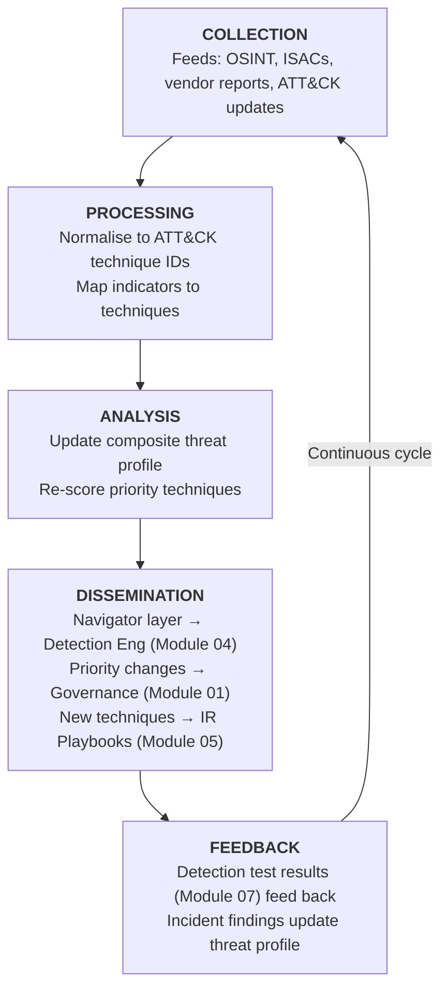

# 03 — Threat Intelligence

> **MITRE SOC Strategy Addressed:**
> - Strategy 6: Illuminate Adversaries with Cyber Threat Intelligence

---

## Purpose

Threat intelligence transforms raw threat data into actionable context that drives every other pipeline module. In this pipeline, **MITRE ATT&CK** is the central intelligence framework — it provides the common language for describing adversary behavior and the structure for prioritizing detection, response, and countermeasure efforts.

---

## MITRE ATT&CK as the Intelligence Backbone

### ATT&CK Structure

```mermaid
flowchart TD
    ATT["ATT&CK Enterprise Matrix"]

    ATT --> TAC["<b>Tactics (14)</b><br/><i>WHY an adversary acts</i>"]
    TAC --> T1["Reconnaissance"]
    TAC --> T2["Resource Development"]
    TAC --> T3["Initial Access"]
    TAC --> T4["Execution"]
    TAC --> T5["Persistence"]
    TAC --> T6["Privilege Escalation"]
    TAC --> T7["Defense Evasion"]
    TAC --> T8["Credential Access"]
    TAC --> T9["Discovery"]
    TAC --> T10["Lateral Movement"]
    TAC --> T11["Collection"]
    TAC --> T12["Command and Control"]
    TAC --> T13["Exfiltration"]
    TAC --> T14["Impact"]

    ATT --> TECH["<b>Techniques (~200)</b><br/><i>HOW an adversary achieves a tactic</i>"]
    TECH --> SUB["Sub-techniques<br/>Specific implementations"]

    ATT --> GRP["<b>Groups (~140)</b><br/><i>WHO — named threat actor clusters</i>"]
    ATT --> SW["<b>Software (~680)</b><br/><i>WHAT tools/malware adversaries use</i>"]
    ATT --> DS["<b>Data Sources</b><br/><i>WHERE to look in your telemetry</i>"]
```



### How ATT&CK Feeds Each Pipeline Module

| Pipeline Module | ATT&CK Usage |
|---|---|
| 01-Governance | Risk-based prioritization of techniques to defend against |
| 02-Data Documentation | ATT&CK Data Sources → identify required telemetry |
| 04-Detection Engineering | Techniques → analytics targets; DeTTECT coverage scoring |
| 05-Incident Response | Techniques → RE&CT response action mapping |
| 06-Countermeasures | Techniques → D3FEND defensive technique mapping |
| 07-Detection Testing | Techniques → Atomic Red Team test selection |

---

## Threat Profiling Process

### Step 1: Identify Relevant Threat Actors

Start by identifying which ATT&CK Groups are relevant to your organization based on:

- **Industry vertical** (e.g., healthcare, finance, defense, energy)
- **Geographic region** (nation-state targeting patterns)
- **Asset type** (cloud-heavy, OT/ICS, traditional enterprise)
- **Historical incidents** (what has actually hit your organization or sector)

```markdown
## Threat Profile: [Organization Name]

### Sector: [e.g., Financial Services]
### Region: [e.g., North America]

### Priority Threat Groups:

| Group | ATT&CK ID | Motivation | Relevance |
|---|---|---|---|
| APT38 | G0082 | Financial theft | Direct sector targeting |
| FIN7 | G0046 | Financial theft | Active campaigns against sector |
| APT29 | G0016 | Espionage | Supply chain risk |
| Wizard Spider | G0102 | Ransomware | Cross-sector targeting |
```

### Step 2: Extract Technique Sets

For each priority threat group, pull their known techniques from ATT&CK:

```
Group: APT38 (G0082)
├── T1566.001 - Spearphishing Attachment
├── T1059.001 - PowerShell
├── T1053.005 - Scheduled Task
├── T1071.001 - Web Protocols (C2)
├── T1486     - Data Encrypted for Impact
├── T1560.001 - Archive via Utility
└── ... (full list from ATT&CK)
```

### Step 3: Build a Composite Threat Profile

Merge technique lists from all priority groups into a single composite heat map. Techniques used by multiple relevant groups receive higher priority:

| Technique | T-ID | APT38 | FIN7 | APT29 | Wizard Spider | Count | Priority |
|---|---|---|---|---|---|---|---|
| Spearphishing Attachment | T1566.001 | X | X | X | X | 4 | Critical |
| PowerShell | T1059.001 | X | X | X | X | 4 | Critical |
| Scheduled Task | T1053.005 | X | X | | X | 3 | High |
| Valid Accounts | T1078 | | X | X | X | 3 | High |
| Web Protocols (C2) | T1071.001 | X | X | X | | 3 | High |
| OS Credential Dumping | T1003 | X | | X | X | 3 | High |
| Remote Services | T1021 | | X | X | X | 3 | High |
| Ingress Tool Transfer | T1105 | X | X | | | 2 | Medium |

### Step 4: ATT&CK Navigator Layer

Export the composite threat profile as an ATT&CK Navigator layer for visualization and sharing:

```json
{
    "name": "Composite Threat Profile - [Org Name]",
    "versions": {
        "attack": "14",
        "navigator": "4.9",
        "layer": "4.5"
    },
    "domain": "enterprise-attack",
    "description": "Priority techniques based on threat group analysis",
    "techniques": [
        {
            "techniqueID": "T1566.001",
            "tactic": "initial-access",
            "score": 100,
            "color": "#ff0000",
            "comment": "Used by APT38, FIN7, APT29, Wizard Spider"
        },
        {
            "techniqueID": "T1059.001",
            "tactic": "execution",
            "score": 100,
            "color": "#ff0000",
            "comment": "Used by APT38, FIN7, APT29, Wizard Spider"
        }
    ]
}
```

Save Navigator layers as `.json` files in this module directory for import into ATT&CK Navigator.

---

## Intelligence-Driven Prioritization

### The Prioritization Formula

Not all techniques are equally important. Use this multi-factor scoring to prioritize:

```
Priority Score = (Threat Frequency × 3) + (Impact × 2) + (Detection Feasibility × 1)

Where:
  Threat Frequency  = How many relevant groups use this technique (1-5)
  Impact            = Potential damage if technique succeeds (1-5)
  Detection Feasibility = How detectable given current data (1-5, inverted:
                          5 = easy to detect, 1 = very hard)
```

| Factor | Weight | Rationale |
|---|---|---|
| Threat Frequency | 3x | Techniques used by more groups are more likely to be encountered |
| Impact | 2x | High-impact techniques (ransomware, data theft) warrant more investment |
| Detection Feasibility | 1x | Factor in effort — easy wins matter, but don't ignore hard problems |

### Priority Tiers

| Tier | Score Range | Action |
|---|---|---|
| **Critical** | 25-30 | Immediate detection engineering + response playbook + countermeasure |
| **High** | 18-24 | Detection engineering + response playbook |
| **Medium** | 12-17 | Detection engineering (next sprint) |
| **Low** | 6-11 | Monitor via threat intel feeds, plan for future |

---

## CTI Operations Workflow



### Intelligence Products

| Product | Audience | Cadence | Content |
|---|---|---|---|
| **ATT&CK Coverage Brief** | SOC Analysts, Detection Engineers | Monthly | Current detection coverage vs. threat profile |
| **Threat Landscape Update** | SOC Manager, CISO | Quarterly | Changes in threat actor activity, new techniques |
| **Technique Deep Dive** | Detection Engineers, Hunters | As needed | Detailed analysis of a single technique for analytics development |
| **Incident Intel Report** | All SOC, IR, Management | Per incident | ATT&CK-mapped findings from real incidents |

---

## Inputs

| Input | Source Module | Description |
|---|---|---|
| Crown Jewel List & Risk Context | [01 Governance](../01-Governance/) | Business-critical assets and risk appetite for threat prioritisation |
| Data Source Inventory | [02 Data Documentation](../02-Data-Documentation/) | Available telemetry — determines detection feasibility scoring |
| OSSEM-DM Relationship Map | [02 Data Documentation](../02-Data-Documentation/) | Observable entity relationships — what threats we *can* see in data |
| Detection Test Results | [07 Detection Testing](../07-Detection-Testing/) | Validated detection scores feed back into threat profile re-prioritisation |
| Incident Intel Reports | [05 Incident Response](../05-Incident-Response/) | ATT&CK-mapped incident findings updating composite threat profile |
| Forensic ATT&CK Technique Maps | [08 Forensics & DFIR](../08-Forensics-DFIR/) | Confirmed adversary techniques from forensic analysis |
| New Indicators of Compromise | [08 Forensics & DFIR](../08-Forensics-DFIR/) | IOCs extracted from forensic evidence for TIP ingestion |
| External Threat Feeds | External (ISACs, OSINT, Vendor) | STIX/TAXII feeds, threat reports, community intelligence |

---

## Outputs

| Output | Consumers | Description |
|---|---|---|
| Composite Threat Profile | All modules | Prioritized list of ATT&CK techniques relevant to the organization |
| ATT&CK Navigator Layers | Module 04, 07 | Visual heat maps for coverage analysis |
| Prioritized Technique List | Module 04 (Detection), Module 05 (IR) | Ordered list driving detection and playbook development |
| Data Source Requirements | Module 02 (Data) | ATT&CK data sources needed for priority techniques |
| Intelligence Products | Module 01 (Governance) | Regular reporting for oversight and risk management |

---

## Implementation Checklist

- [ ] Identify threat actors relevant to organization (sector, region, assets)
- [ ] Pull technique lists for each group from ATT&CK
- [ ] Build composite threat profile with frequency counts
- [ ] Score and tier all techniques using the prioritization formula
- [ ] Generate ATT&CK Navigator layer (.json) for the threat profile
- [ ] Cross-reference with Module 02 data sources — identify intel-driven data gaps
- [ ] Establish CTI collection feeds (OSINT, ISACs, vendor)
- [ ] Define intelligence product cadence and distribution list
- [ ] Create feedback mechanism from Module 07 testing results
- [ ] Schedule quarterly threat profile reviews

---

## References

- [MITRE ATT&CK](https://attack.mitre.org/)
- [ATT&CK Navigator](https://mitre-attack.github.io/attack-navigator/)
- [ATT&CK Groups](https://attack.mitre.org/groups/)
- [ATT&CK Data Sources](https://attack.mitre.org/datasources/)
- [MITRE 11 Strategies — Strategy 6](https://www.mitre.org/sites/default/files/2022-04/11-strategies-of-a-world-class-cybersecurity-operations-center.pdf)
