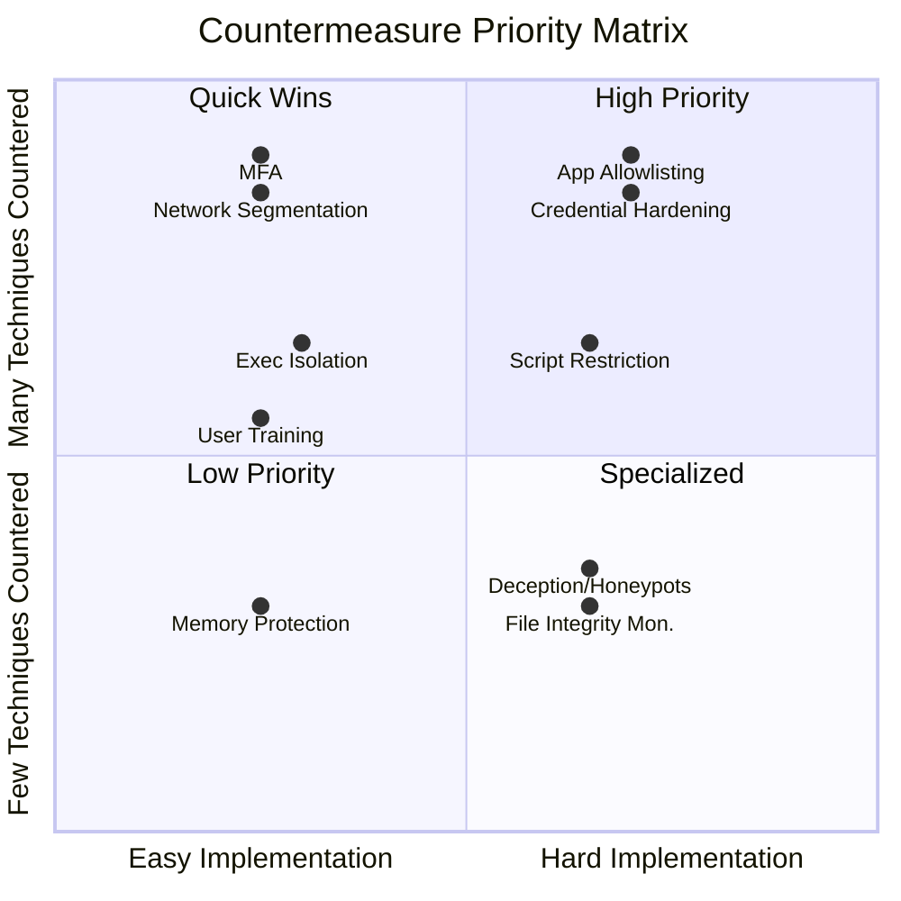
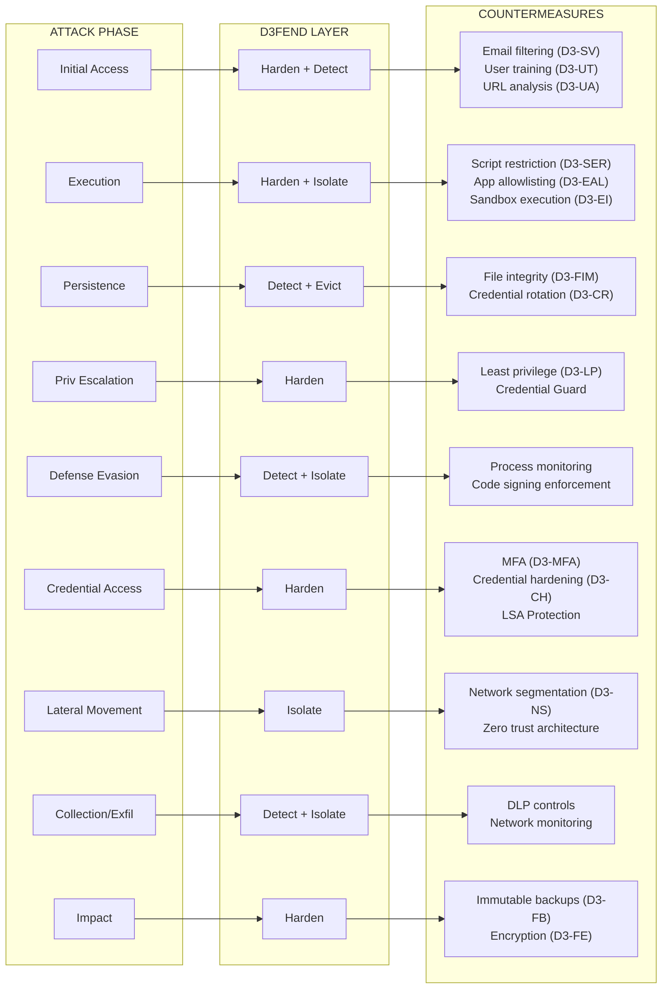

# 06 — Countermeasures

> **MITRE SOC Strategy Addressed:**
> - Strategy 11: Turn up the Dial Incrementally (defensive hardening)

---

## Purpose

Not every ATT&CK technique can be reliably detected. Some require preventive countermeasures — hardening configurations, architectural controls, and active defense mechanisms that make techniques fail before detection is even needed. This module uses **MITRE D3FEND** to systematically map defensive techniques against the ATT&CK techniques in the organization's threat profile.

---

## MITRE D3FEND Overview

### What is D3FEND?

D3FEND is a knowledge graph of cybersecurity countermeasure techniques. Where ATT&CK describes *how adversaries attack*, D3FEND describes *how defenders can counter those attacks*. Each D3FEND technique specifies:

- What it does (the defensive action)
- What digital artifacts it operates on
- Which ATT&CK techniques it counters

### D3FEND Taxonomy

```mermaid
flowchart TD
    ROOT["D3FEND Defensive Techniques"]

    ROOT --> HARDEN["Harden"]
    HARDEN --> H1["Application Hardening"]
    HARDEN --> H2["Credential Hardening"]
    HARDEN --> H3["Message Hardening"]
    HARDEN --> H4["Platform Hardening"]
    HARDEN --> H5["User Training"]

    ROOT --> DETECT["Detect"]
    DETECT --> D1["File Analysis"]
    DETECT --> D2["Identifier Analysis"]
    DETECT --> D3["Message Analysis"]
    DETECT --> D4["Network Traffic Analysis"]
    DETECT --> D5["Platform Monitoring"]
    DETECT --> D6["Process Analysis"]
    DETECT --> D7["User Behavior Analysis"]

    ROOT --> ISOLATE["Isolate"]
    ISOLATE --> I1["Execution Isolation"]
    ISOLATE --> I2["Network Isolation"]

    ROOT --> DECEIVE["Deceive"]
    DECEIVE --> DC1["Decoy Environment"]
    DECEIVE --> DC2["Decoy Object"]
    DECEIVE --> DC3["Decoy Persona"]

    ROOT --> EVICT["Evict"]
    EVICT --> E1["Credential Eviction"]
    EVICT --> E2["File Eviction"]
    EVICT --> E3["Process Eviction"]
```



---

## ATT&CK-to-D3FEND Mapping Process

### Step 1: Start with the Detection Gap Analysis

Take the gap analysis output from Module 04 (DeTTECT). Techniques with low detection scores are prime candidates for countermeasures:

```
Module 04 Gap Analysis
│
├── T1059.001 (PowerShell) — Detection Score: 3
│   → Detection adequate, but add hardening for defense-in-depth
│
├── T1218.011 (Rundll32) — Detection Score: 1
│   → Detection weak, prioritize countermeasures
│
├── T1055 (Process Injection) — Detection Score: 1
│   → Very hard to detect reliably, countermeasures critical
│
└── T1078 (Valid Accounts) — Detection Score: 2
    → Supplement detection with credential hardening
```

### Step 2: Map Each Technique to D3FEND Countermeasures

| ATT&CK Technique | D3FEND Countermeasure | D3FEND ID | Implementation |
|---|---|---|---|
| T1059.001 PowerShell | Script Execution Restriction | D3-SER | Constrained Language Mode, WDAC |
| T1059.001 PowerShell | Execution Prevention | D3-EP | AppLocker / WDAC policy |
| T1055 Process Injection | Process Code Segment Verification | D3-PCSV | EDR memory protection |
| T1055 Process Injection | Execution Isolation | D3-EI | Windows Defender Credential Guard |
| T1078 Valid Accounts | Multi-factor Authentication | D3-MFA | Enforce MFA on all accounts |
| T1078 Valid Accounts | Credential Rotation | D3-CR | Automated password rotation |
| T1078 Valid Accounts | Account Locking | D3-AL | Lockout policies after N failures |
| T1218.011 Rundll32 | Executable Allowlisting | D3-EAL | WDAC / AppLocker |
| T1486 Ransomware | File Backup | D3-FB | Immutable backup infrastructure |
| T1486 Ransomware | File Encryption | D3-FE | Data-at-rest encryption |
| T1566.001 Phishing | Sender Verification | D3-SV | DMARC, DKIM, SPF |
| T1566.001 Phishing | User Training | D3-UT | Phishing simulation program |
| T1021 Remote Services | Network Segmentation | D3-NS | Zero trust network architecture |
| T1003 Credential Dumping | Credential Hardening | D3-CH | Disable WDigest, enable LSA Protection |

### Step 3: Create Countermeasure Implementation Plan

For each countermeasure, document the implementation specifics:

```markdown
## Countermeasure: Script Execution Restriction (D3-SER)

### Counters
- T1059.001 - PowerShell
- T1059.005 - Visual Basic
- T1059.007 - JavaScript

### Implementation
1. **PowerShell Constrained Language Mode**
   - Deploy via GPO: `__PSLockdownPolicy = 4`
   - Scope: All workstations, selective servers
   - Exceptions: Authorized admin jump boxes

2. **Windows Defender Application Control (WDAC)**
   - Create WDAC policy allowing only signed scripts
   - Deploy in audit mode first (2 weeks)
   - Review audit logs for legitimate script usage
   - Switch to enforce mode with documented exceptions

3. **AppLocker Script Rules**
   - Block unsigned .ps1, .vbs, .js execution
   - Allow from approved script directories only
   - Log all blocked execution attempts → feed to SIEM

### Validation
- Run Atomic Red Team T1059.001 tests → should be BLOCKED
- Verify legitimate admin workflows still function
- Monitor false positive rate in first 30 days

### Risk
- Medium: May break legitimate automation if exceptions not properly scoped
- Mitigation: Audit mode first, document all exceptions before enforcement

### Status
- [ ] Policy drafted
- [ ] Tested in lab
- [ ] Deployed in audit mode
- [ ] Exceptions documented
- [ ] Deployed in enforce mode
- [ ] Validated with Atomic tests
```

---

## Countermeasure Priority Matrix

Cross-reference the number of ATT&CK techniques a countermeasure addresses against implementation difficulty:



**Priority order:** Upper-left (many techniques, easy to implement) → Lower-right

---

## Defense-in-Depth Layers

Map countermeasures across the kill chain to ensure defense-in-depth:



---

## Active Defense Integration

D3FEND's **Deceive** category enables active defense — making the adversary's job harder and generating high-fidelity alerts:

### Deception Techniques

| D3FEND Technique | Implementation | Detection Value |
|---|---|---|
| Decoy Account (D3-DA) | Honeypot AD accounts with logon alerts | Any use = confirmed adversary |
| Decoy Credential (D3-DC) | Fake credentials in memory / LSASS | Credential theft confirmation |
| Decoy File (D3-DF) | Canary documents in sensitive shares | Data access / exfil confirmation |
| Decoy Network Resource (D3-DNR) | Honeypot services (SMB, SSH, RDP) | Lateral movement confirmation |
| Decoy Persona (D3-DP) | Fake employee profiles in directory | Social engineering detection |

**Key advantage:** Deception-based detections have near-zero false positive rates. Any interaction with a decoy is suspicious by definition.

---

## Inputs

| Input | Source Module | Description |
|---|---|---|
| Detection Gap Analysis | [04 Detection Engineering](../04-Detection-Engineering/) | DeTTECT low-score techniques — prime candidates for preventive countermeasures |
| Prioritised Technique List | [03 Threat Intelligence](../03-Threat-Intelligence/) | ATT&CK threat profile driving countermeasure prioritisation |
| Test Results (Block Validation) | [07 Detection Testing](../07-Detection-Testing/) | Atomic RT results verifying countermeasure effectiveness |
| Gap Remediation Tickets | [07 Detection Testing](../07-Detection-Testing/) | Failed detection tests where countermeasures may be the better mitigation |
| Incident Lessons Learned | [05 Incident Response](../05-Incident-Response/) | Techniques that succeeded against the environment — hardening candidates |
| Forensic Findings | [08 Forensics & DFIR](../08-Forensics-DFIR/) | Confirmed adversary techniques requiring preventive controls |

---

## Outputs

| Output | Consumers | Description |
|---|---|---|
| ATT&CK-to-D3FEND Mapping | [01 Governance](../01-Governance/), [04 Detection Eng](../04-Detection-Engineering/) | Technique-to-countermeasure matrix |
| Countermeasure Implementation Plans | IT Operations, Security Engineering | Detailed deployment guides per countermeasure |
| Countermeasure Validation Results | [07 Detection Testing](../07-Detection-Testing/) | Atomic test results showing blocked techniques |
| Active Defense Deployment Plan | SOC, Security Engineering | Deception layer implementation |
| Defense-in-Depth Coverage Map | [01 Governance](../01-Governance/) | Kill chain coverage by countermeasure layer |
| Countermeasure Status | [05 Incident Response](../05-Incident-Response/) | Deployed controls informing IR containment and eradication decisions |

---

## Implementation Checklist

- [ ] Pull detection gap analysis from Module 04 (DeTTECT low-score techniques)
- [ ] Map each low-score technique to D3FEND countermeasures
- [ ] Prioritize countermeasures using the priority matrix (coverage vs. difficulty)
- [ ] Create implementation plans for top-priority countermeasures
- [ ] Deploy first wave in audit/monitor mode
- [ ] Validate with Atomic Red Team (technique should be BLOCKED)
- [ ] Transition audit mode to enforcement with documented exceptions
- [ ] Deploy deception layer (honeypot accounts, canary files)
- [ ] Integrate deception alerts into SIEM (high-fidelity, no tuning needed)
- [ ] Map all countermeasures to defense-in-depth layers
- [ ] Schedule quarterly review: re-assess against updated threat profile

---

## References

- [MITRE D3FEND](https://d3fend.mitre.org/)
- [D3FEND Knowledge Graph](https://d3fend.mitre.org/resources/)
- [D3FEND ATT&CK Mappings](https://d3fend.mitre.org/offensive-technique/)
- [MITRE 11 Strategies — Strategy 11](https://www.mitre.org/sites/default/files/2022-04/11-strategies-of-a-world-class-cybersecurity-operations-center.pdf)
