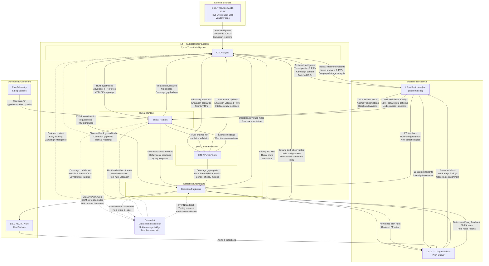
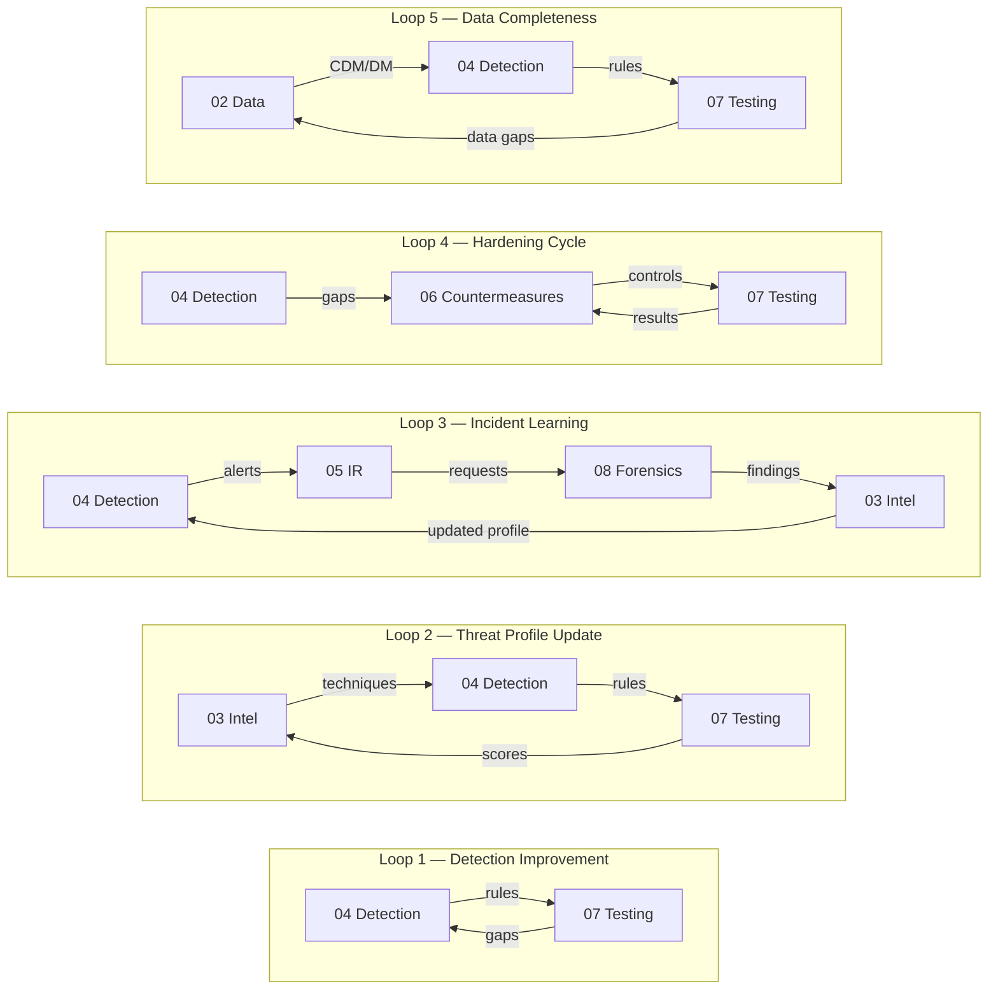
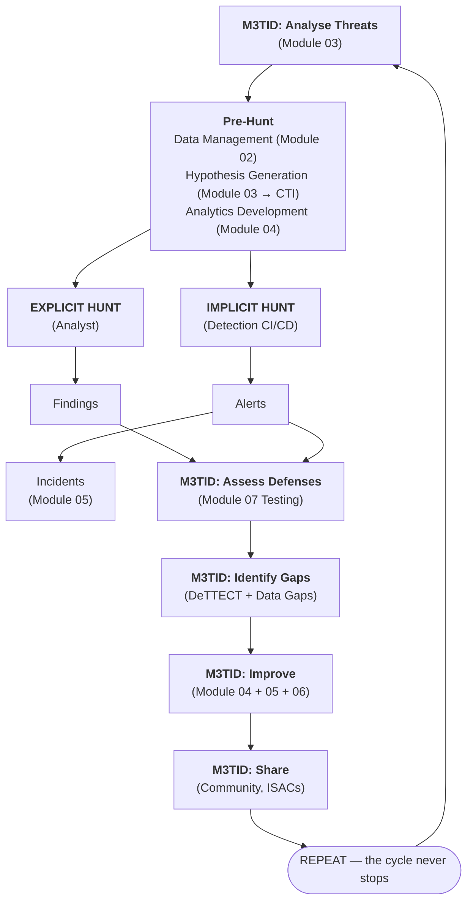
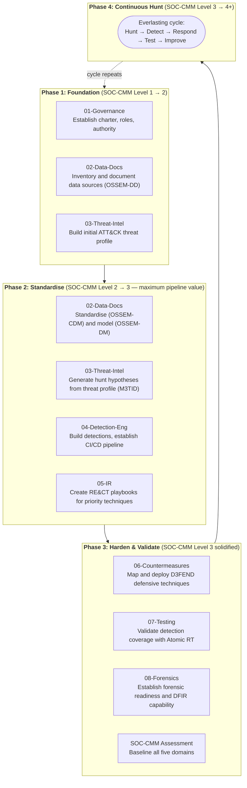

# Threat-Informed Defense SOC Pipeline

A structured, open-framework pipeline for building and maturing a Security Operations Center (SOC) using threat-informed defense principles. This project maps directly to the **MITRE 11 Strategies of a World-Class Cybersecurity Operations Center** and integrates leading open-source and government frameworks at every stage.

> **Core Philosophy:** Threat-informed defense is an everlasting baseline hunt with detection engineering CI/CD. Every detection rule is a codified hunt hypothesis running continuously. The pipeline never completes — it cycles.

---

## Pipeline Architecture



---

## SOC Role Relationships

The diagram above maps every **input and output** between operational SOC roles — showing exactly what each function produces and consumes. It adds the **human layer** to the pipeline: who talks to whom, and what they exchange.

> View the interactive version: [`docs/soc-role-diagram.html`](docs/soc-role-diagram.html)

| Role | Layer | Primary Function |
|---|---|---|
| **CTI Analysts** | L4 — SME | Convert raw intelligence into finished, actionable threat profiles |
| **Threat Hunters** | L4 — SME | Generate and validate hypotheses; discover undiscovered intrusions |
| **Detection Engineers** | L4 — SME | Codify hunt findings into automated Sigma/YARA/EDR detections |
| **CTE / Purple Team** | L4 — SME | Emulate adversaries to validate detection coverage and control efficacy |
| **L3 Senior Analyst** | Operational | Lead incident response; provide tactical intel and hunt leads from live cases |
| **L1-L2 Triage Analysts** | Operational | Work the alert queue; escalate and feed ground-truth observables upstream |
| **Generalist** | Cross-domain | Provide shift coverage across all tiers; act as feedback conduit between functions |

### Key Information Flows

| From | To | What Flows |
|---|---|---|
| **External feeds** | CTI | Raw OSINT, ISAC advisories, IOCs, dark web reporting |
| **CTI** | L3, L1L2 | Finished intelligence, enriched IOCs, threat briefs, watch lists |
| **CTI** | Hunters | Hunt hypotheses, ATT&CK-mapped TTP profiles |
| **CTI** | Detection Eng | TTP-driven detection requirements, IOC signatures |
| **CTI** | CTE | Adversary playbooks, emulation scenarios, priority TTPs |
| **Hunters** | L3 | Confirmed threat activity, undiscovered intrusions |
| **Hunters** | Detection Eng | New detection candidates, behavioural baselines, query templates |
| **Hunters** | CTI | Validated/invalidated hypotheses, coverage gap findings |
| **Detection Eng** | SIEM/EDR | Sigma/YARA rules, correlation rules, custom detections |
| **Detection Eng** | L1-L2 | New and tuned alert rules, reduced false-positive rates |
| **CTE** | Detection Eng | Coverage gap reports, detection validation results |
| **CTE** | CTI | Emulation-validated TTPs, intel accuracy feedback |
| **L3** | CTI | Tactical intel, novel artefacts, campaign linkage analysis |
| **L3** | Hunters | Hunt leads, anomaly observations, baseline deviations |
| **L3** | Detection Eng | FP feedback, rule tuning requests, new detection gaps |
| **L1-L2** | L3 | Escalated alerts, initial triage findings |
| **L1-L2** | CTI | Ground truth observables, collection gap RFIs |
| **L1-L2** | Detection Eng | FP/FN rates, rule noise reports |
| **Generalist** | CTI / Hunters / DE | Cross-tier feedback, observables, tuning requests (dashed — ad-hoc) |

---

## Module Data Flow

Every module in the pipeline has explicit **inputs** (what it consumes) and **outputs** (what it produces). The pipeline is not a linear sequence — it is a **directed graph with feedback loops**. The table below summarises every inter-module data flow:

| From | To | What Flows | Direction |
|---|---|---|---|
| **01 Governance** | 02, 03, 05, 08 | SOC charter, crown jewel list, risk context, legal authority | Forward |
| **02 Data Documentation** | 03, 04, 05, 07, 08 | Data source inventory, CDM mappings, DM relationships, quality scores | Forward |
| **03 Threat Intelligence** | 02, 04, 05, 06, 07, 08 | Prioritised technique list, Navigator layers, data source requirements, IOCs | Forward + Backward |
| **04 Detection Engineering** | 01, 05, 06, 07 | Detection alerts, Sigma rules, DeTTECT layers, gap analysis | Forward |
| **05 Incident Response** | 01, 03, 04, 08 | Incident reports, lessons learned, detection gaps, acquisition requests | Feedback |
| **06 Countermeasures** | 01, 05, 07 | D3FEND mappings, countermeasure status, defence-in-depth map | Forward |
| **07 Detection Testing** | 01, 03, 04, 06 | Test results, validated DeTTECT scores, coverage dashboard, gap tickets | Feedback |
| **08 Forensics & DFIR** | 01, 02, 03, 04, 07 | Investigation reports, ATT&CK maps, IOCs, detection gaps, data source gaps | Feedback |

### Key Feedback Loops



---

## MITRE 11 Strategies Mapping

Each pipeline module maps to one or more of the MITRE 11 Strategies for a World-Class SOC:

| # | MITRE SOC Strategy | Pipeline Module(s) | Primary Frameworks |
|---|---|---|---|
| 1 | **Know What You Are Protecting and Why** | [01-Governance](01-Governance/) | NIST CSF 2.0 (ID.AM, GV), DoDCWF 8140 |
| 2 | **Give the SOC the Authority to Do Its Job** | [01-Governance](01-Governance/) | NIST CSF 2.0 (GV), ASD Cyber Skills Framework |
| 3 | **Build a SOC Structure to Match Your Organizational Needs** | [01-Governance](01-Governance/) | ASD CSF, DoDCWF 8140, CIISec |
| 4 | **Hire AND Grow Quality Staff** | [01-Governance](01-Governance/) | ASD CSF, DoDCWF 8140, CIISec Skills Framework |
| 5 | **Prioritize Incident Response** | [05-Incident-Response](05-Incident-Response/), [08-Forensics-DFIR](08-Forensics-DFIR/) | RE&CT Framework, DFIR Toolchain |
| 6 | **Illuminate Adversaries with Cyber Threat Intelligence** | [03-Threat-Intelligence](03-Threat-Intelligence/) | MITRE ATT&CK, M3TID |
| 7 | **Select and Collect the Right Data** | [02-Data-Documentation](02-Data-Documentation/) | OSSEM (DD, CDM, DM), Threat Hunters Playbook |
| 8 | **Leverage Tools to Support Analyst Workflow** | [04-Detection-Engineering](04-Detection-Engineering/) | DeTTECT, MITRE CAR, Sigma |
| 9 | **Communicate Clearly, Collaborate Often, Share Generously** | [01-Governance](01-Governance/), All Modules | NIST CSF 2.0 (GV.RR), M3TID (Focused Sharing) |
| 10 | **Measure Performance to Improve Performance** | [07-Detection-Testing](07-Detection-Testing/) | Atomic Red Team, attack_range, SOC-CMM |
| 11 | **Turn up the Dial Incrementally** | [references/](references/) | SOC-CMM, Maturity Model |

---

## Module Index

| Module | Continuous Hunt Role | Key Frameworks & Tools |
|---|---|---|
| [01-Governance](01-Governance/) | **Authority** — mandate, budget, staffing for continuous operations | NIST CSF 2.0, ASD CSF, DoDCWF 8140, CIISec |
| [02-Data-Documentation](02-Data-Documentation/) | **Foundation** — data management disciplines that make data huntable | OSSEM (DD, CDM, DM), Threat Hunters Playbook Pre-Hunt |
| [03-Threat-Intelligence](03-Threat-Intelligence/) | **Direction** — CTI-driven hypothesis generation; threat profile focus | MITRE ATT&CK, M3TID |
| [04-Detection-Engineering](04-Detection-Engineering/) | **Codification** — promotes hunt findings into permanent automated detections | DeTTECT, MITRE CAR, Sigma, Detection CI/CD |
| [05-Incident-Response](05-Incident-Response/) | **Activation** — executes when a codified hunt (detection) fires | RE&CT Framework |
| [06-Countermeasures](06-Countermeasures/) | **Hardening** — prevents techniques that can't be hunted/detected reliably | MITRE D3FEND |
| [07-Detection-Testing](07-Detection-Testing/) | **Validation** — verifies codified hunts (detections) still work | Atomic Red Team, attack_range |
| [08-Forensics-DFIR](08-Forensics-DFIR/) | **Evidence** — ground-truth artefacts that confirm adversary presence and generate new hunt leads | Velociraptor, Volatility 3, Plaso, Autopsy |

---

## The Continuous Hunt Cycle

This pipeline operates as an **everlasting baseline hunt** — not a linear build-once process:



For the full methodology, see [references/m3tid-continuous-hunt.md](references/m3tid-continuous-hunt.md).

---

## Maturity Assessment (SOC-CMM)

This pipeline uses the **SOC Capability Maturity Model (SOC-CMM)** as its primary maturity framework, providing holistic assessment across five domains:

| SOC-CMM Domain | What It Assesses | Primary Pipeline Module |
|---|---|---|
| **Business** | Governance, budget, strategy, stakeholders, compliance, risk | 01 Governance |
| **People** | Staffing, training, careers, knowledge, collaboration | Workforce Roles (DoDCWF, ASD, CIISec) |
| **Process** | Procedures, use cases, incidents, automation, metrics | 03, 04, 05, 07 |
| **Technology** | SIEM, EDR, NSM, SOAR, TIP, testing infrastructure | 02, 04, 07 |
| **Services** | Monitoring, IR, CTI, hunting, forensics, testing | All modules |

**Target Level 3 across all domains before pushing any single domain to Level 4+.**

For the full SOC-CMM reference, see [references/soc-cmm.md](references/soc-cmm.md).
For maturity criteria per pipeline module, see [references/maturity-model.md](references/maturity-model.md).

---

## Getting Started

### Prerequisites

- Familiarity with MITRE ATT&CK Navigator
- Access to a SIEM/log aggregation platform
- Python 3.8+ (for DeTTECT, attack_range tooling)
- Git (for version-controlled detection-as-code)

### Recommended Progression



---

## Framework Reference Links

| Framework | Source |
|---|---|
| MITRE 11 Strategies | [11 Strategies of a World-Class Cybersecurity Operations Center](https://www.mitre.org/sites/default/files/2022-04/11-strategies-of-a-world-class-cybersecurity-operations-center.pdf) |
| SOC-CMM | [SOC Capability Maturity Model](https://www.soc-cmm.com) |
| M3TID / CTID | [MITRE Engenuity Center for Threat-Informed Defense](https://ctid.mitre-engenuity.org/) |
| NIST CSF 2.0 | [NIST Cybersecurity Framework 2.0](https://www.nist.gov/cyberframework) |
| ASD Cyber Skills Framework | [Australian Signals Directorate CSF](https://www.cyber.gov.au/) |
| CIISec Skills Framework | [Chartered Institute of Information Security](https://www.ciisec.org/skills-framework) |
| DoD 8140 / DoDCWF | [DoD Cyberspace Workforce Framework](https://public.cyber.mil/cw/dcwf/) |
| OSSEM | [Open Source Security Events Metadata](https://github.com/OTRF/OSSEM) |
| Threat Hunters Playbook | [Threat Hunter Playbook](https://github.com/OTRF/ThreatHunter-Playbook) |
| MITRE ATT&CK | [ATT&CK Knowledge Base](https://attack.mitre.org/) |
| DeTTECT | [DeTT&CT Framework](https://github.com/rabobank-cdc/DeTTECT) |
| MITRE CAR | [Cyber Analytics Repository](https://car.mitre.org/) |
| Atomic Red Team | [Atomic Red Team](https://github.com/redcanaryco/atomic-red-team) |
| RE&CT | [RE&CT Framework](https://github.com/atc-project/atc-react) |
| MITRE D3FEND | [D3FEND Knowledge Graph](https://d3fend.mitre.org/) |
| Splunk attack_range | [attack_range](https://github.com/splunk/attack_range) |

---

## Project Structure

```
THREAT-INFORMED-DEFENSE-SOC-PIPELINE/
├── README.md                              # This file
├── docs/
│   └── soc-role-diagram.html              # Interactive SOC role input/output diagram
├── 01-Governance/
│   └── README.md                          # NIST CSF 2.0, ASD CSF, DoDCWF 8140, CIISec
├── 02-Data-Documentation/
│   ├── README.md                          # OSSEM, TH Playbook — 4 data management disciplines
│   ├── data-standardisation.md            # OSSEM-CDM field normalisation guide
│   └── data-modelling.md                  # OSSEM-DM entity relationship modelling guide
├── 03-Threat-Intelligence/
│   └── README.md                          # MITRE ATT&CK, M3TID threat profiling
├── 04-Detection-Engineering/
│   └── README.md                          # DeTTECT, MITRE CAR, Sigma, Detection CI/CD
├── 05-Incident-Response/
│   └── README.md                          # RE&CT Framework
├── 06-Countermeasures/
│   └── README.md                          # MITRE D3FEND
├── 07-Detection-Testing/
│   └── README.md                          # Atomic Red Team, attack_range
├── 08-Forensics-DFIR/
│   └── README.md                          # DFIR capability areas, tool options, artefact reference
└── references/
    ├── soc-cmm.md                         # SOC-CMM — full framework, 5 domains, assessment
    ├── maturity-model.md                  # SOC-CMM-based maturity progression per module
    ├── m3tid-continuous-hunt.md            # M3TID + pre-hunt methodology + continuous hunt
    ├── workforce-roles.md                 # DoDCWF, ASD, CIISec role mapping
    ├── tool-integration-matrix.md         # Tool options matrix — curated OSS tools per capability
    ├── metrics.md                         # KPIs, KRIs, SOC-CMM self-assessment scorecard
    └── agentic-soc.md                     # Human-AI operating model — 6 SOC agents
```

---

## License

This project is released for educational and defensive cybersecurity purposes. Individual frameworks and tools referenced retain their own licensing terms.
