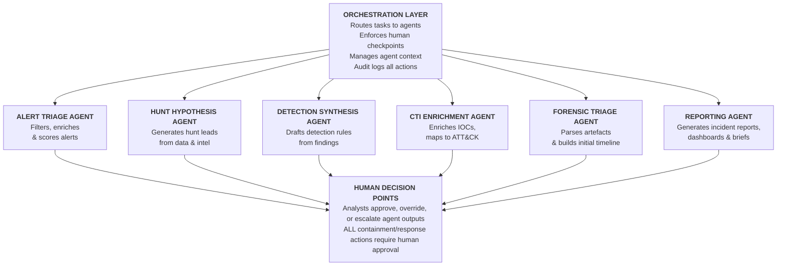
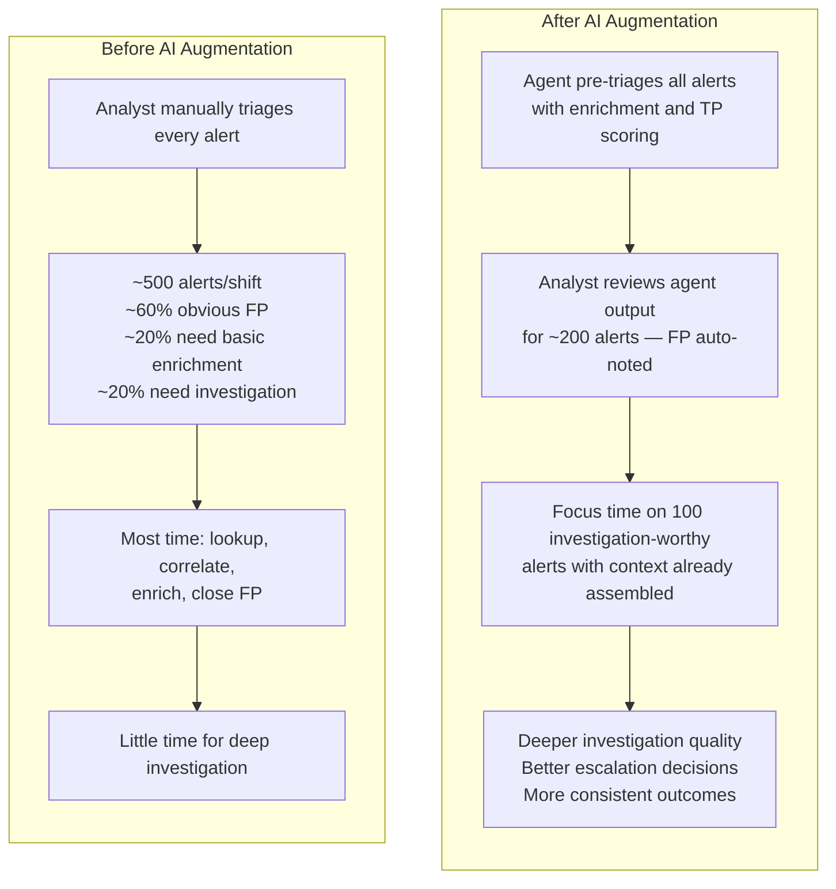
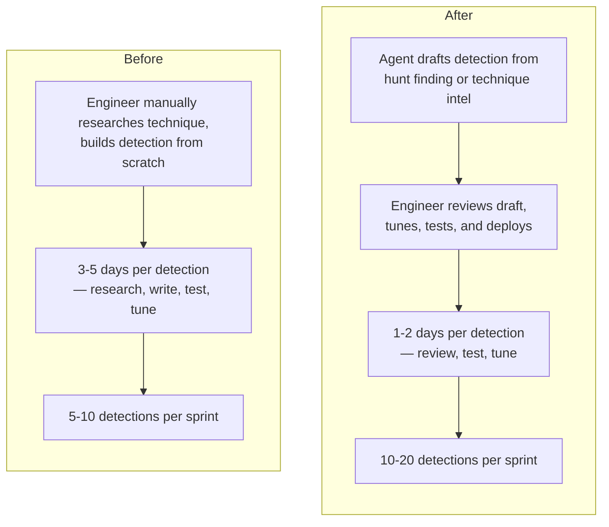
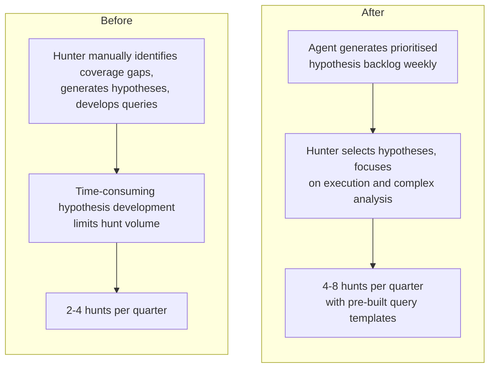
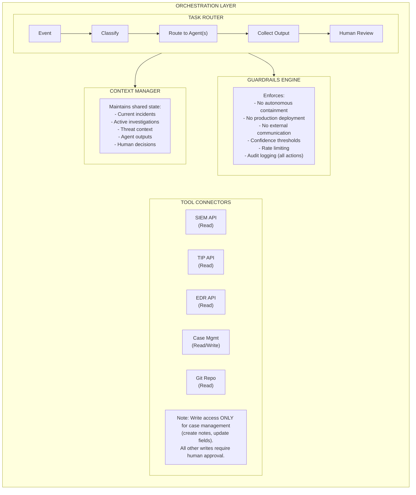

# Agentic SOC Layer — Human-AI Operating Model

> Architecture for AI-augmented SOC operations where specialised AI agents handle routine cognitive tasks under human supervision, freeing analysts for complex investigation and strategic decision-making.
>
> **Core Principle:** AI agents execute; humans decide. Every agent operates within defined boundaries with mandatory human checkpoints for high-impact actions. The SOC doesn't automate humans away — it amplifies them.

---

## Why an Agentic Layer?

The traditional SOC suffers from three structural problems that technology alone hasn't solved:

| Problem | Root Cause | How Agents Help |
|---|---|---|
| **Alert fatigue** | Analysts process thousands of alerts manually; cognitive load exceeds human capacity | Alert Triage Agent filters, enriches, and prioritises before human review |
| **Repetitive cognitive work** | 60-80% of analyst time spent on repetitive investigation steps (lookup, correlate, enrich) | Specialised agents handle routine investigation workflows |
| **Inconsistency** | Different analysts reach different conclusions from the same evidence; quality depends on who's on shift | Agents apply consistent logic; human analysts focus on nuance and judgement |

**What agents are NOT:** Agents are not a replacement for skilled analysts. They are force multipliers that handle volume so analysts can handle complexity.

---

## SOC-CMM Alignment

| SOC-CMM Domain | Aspect | How the Agentic Layer Contributes |
|---|---|---|
| **Technology** | SOAR / Automation | Agents extend SOAR beyond playbook automation into cognitive task automation |
| **Process** | Automation | Agents automate investigation steps, enrichment, and reporting |
| **Services** | Monitoring & Detection | Agents accelerate triage-to-investigation, reducing MTTD |
| **Services** | Threat Hunting | Hunt Hypothesis Agent generates and prioritises hunt leads |
| **People** | Training & Education | Agents serve as always-available investigation assistants for junior analysts |

**Maturity Prerequisite:** The agentic layer delivers value at **SOC-CMM Level 3+**. Below Level 3, foundational processes and data aren't mature enough for agents to operate reliably. Invest in the pipeline fundamentals (Modules 01-07) before deploying agents.

---

## Agent Architecture

### Six SOC Agents



---

## Agent Specifications

### 1. Alert Triage Agent

| Property | Detail |
|---|---|
| **Trigger** | New SIEM alert arrives in queue |
| **Inputs** | Alert data (fields, severity, source), SIEM context (related events), historical alert data |
| **Actions** | Enrich alert with TIP data, correlate with recent alerts, score true-positive probability, check for known false positive patterns, draft initial investigation summary |
| **Outputs** | Enriched alert with TP score (0-100), recommended priority (Critical/High/Medium/Low/FP), investigation summary, suggested next steps |
| **Human Checkpoint** | Analyst reviews TP score and priority; approves, overrides, or escalates. Agent NEVER closes alerts autonomously for severity >= Medium |
| **Pipeline Integration** | Module 04 (detection metadata), Module 02 (field context), Module 03 (threat context from TIP) |

**Example workflow:**
```
1. SIEM alert: "Suspicious PowerShell Execution" on HOST-WS042
2. Agent enriches:
   - User: jsmith (role: Software Developer, department: Engineering)
   - Host risk: Medium (workstation, not domain admin)
   - CommandLine decoded: IEX(New-Object Net.WebClient).DownloadString(...)
   - URL reputation: Unknown (not in TIP)
   - Parent process: outlook.exe (suspicious chain)
   - Related alerts: None in last 24h for this host
   - Historical: This Sigma rule has 12% FP rate on dev workstations
3. Agent output:
   - TP Score: 82/100
   - Priority: HIGH
   - Summary: "PowerShell download cradle spawned from Outlook. URL
     not in threat feeds but parent process chain (outlook→powershell)
     is consistent with T1566.001 → T1059.001 chain. No prior alerts
     on this host. Recommend immediate investigation."
   - Suggested: Run Module 05 playbook T1059.001
4. Analyst reviews → Confirms HIGH → Investigation begins
```

### 2. Hunt Hypothesis Agent

| Property | Detail |
|---|---|
| **Trigger** | Scheduled (weekly), new threat intel ingested, or analyst request |
| **Inputs** | Threat profile (Module 03), DeTTECT coverage gaps, recent incident findings, SIEM data patterns, community threat reports |
| **Actions** | Analyse coverage gaps against threat profile, identify techniques with low detection but high threat relevance, generate hypotheses in three categories (intelligence-driven, situational, analytics-driven), draft hunt query templates |
| **Outputs** | Prioritised list of hunt hypotheses with rationale, suggested data sources, draft queries, expected evidence patterns |
| **Human Checkpoint** | Threat Hunter reviews and selects hypotheses for execution. Agent does NOT execute hunts autonomously |
| **Pipeline Integration** | Module 03 (threat profile), Module 04 (DeTTECT gaps), Module 02 (data availability), M3TID continuous hunt methodology |

**Example output:**
```markdown
## Hunt Hypothesis: Credential Theft via LSASS Memory Access

**Type:** Intelligence-driven
**Rationale:** APT29 (in threat profile) uses T1003.001 extensively.
  Current DeTTECT score: 2 (partial coverage). Last tested: 45 days ago.
  Recent CISA advisory highlights increased use in current campaign.

**Hypothesis:** If APT29 is targeting our sector, we may see LSASS
  memory access from non-standard tools (not mimikatz.exe).

**Data Sources:** Sysmon EventID 10 (ProcessAccess), EDR memory
  access telemetry, Windows Security 4663

**Draft Query:**
  process_target_name = "lsass.exe"
  AND process_granted_access IN (0x1010, 0x1410, 0x1438)
  AND process_name NOT IN (known_legitimate_list)

**Expected Evidence:** Non-standard processes accessing LSASS with
  suspicious access rights

**Priority:** HIGH — gap in coverage for high-priority technique
```

### 3. Detection Synthesis Agent

| Property | Detail |
|---|---|
| **Trigger** | Hunt finding submitted, new technique intelligence, analyst request |
| **Inputs** | Hunt findings, forensic analysis results, ATT&CK technique details, OSSEM-CDM field mappings, existing Sigma rules, CAR analytics |
| **Actions** | Analyse finding/technique, identify required data sources and CDM fields, draft Sigma rule, check for overlap with existing detections, suggest test procedure |
| **Outputs** | Draft Sigma rule (YAML), mapping to ATT&CK technique, required data sources, suggested Atomic test, estimated false positive assessment |
| **Human Checkpoint** | Detection Engineer reviews, tests, tunes, and approves before deployment. Agent NEVER deploys rules to production |
| **Pipeline Integration** | Module 04 (detection-as-code repo), Module 02 (CDM field names), Module 07 (test procedure suggestion) |

**Example output:**
```yaml
# DRAFT — Requires Detection Engineer review and testing
title: Non-Standard LSASS Memory Access
id: [auto-generated-uuid]
status: experimental
level: high
description: |
  Detects processes accessing LSASS memory with suspicious access rights,
  excluding known legitimate tools. Generated from hunt finding [HUNT-2025-042].
references:
    - https://attack.mitre.org/techniques/T1003/001/
author: Detection Synthesis Agent (requires human review)
logsource:
    category: process_access
    product: windows
detection:
    selection:
        TargetImage|endswith: '\lsass.exe'
        GrantedAccess|contains:
            - '0x1010'
            - '0x1410'
            - '0x1438'
    filter_legitimate:
        SourceImage|endswith:
            - '\MsMpEng.exe'
            - '\csrss.exe'
            - '\lsass.exe'
            - '\svchost.exe'
    condition: selection and not filter_legitimate
falsepositives:
    - Security products with LSASS access requirements
    - Credential management tools
tags:
    - attack.credential_access
    - attack.t1003.001
# SUGGESTED TEST: Atomic Red Team T1003.001 Test #1
# ESTIMATED FP: Medium — filter list may need environment-specific tuning
```

### 4. CTI Enrichment Agent

| Property | Detail |
|---|---|
| **Trigger** | New observable submitted (IP, domain, hash, URL), new threat report ingested, analyst query |
| **Inputs** | Observable data, TIP feeds (MISP/OpenCTI), OSINT sources, historical SIEM data, ATT&CK framework |
| **Actions** | Query TIP for indicator matches, check OSINT reputation sources, search SIEM for historical sightings, map to ATT&CK techniques (if malware/tool identified), assess infrastructure relationships (shared hosting, registration patterns) |
| **Outputs** | Enrichment report with confidence scoring, ATT&CK mapping, related indicators, historical sightings in environment, threat actor attribution (if available) |
| **Human Checkpoint** | CTI Analyst reviews enrichment for accuracy before dissemination. Agent does NOT attribute to threat actors without analyst confirmation |
| **Pipeline Integration** | Module 03 (threat profile update), Module 04 (indicator-based detection), Module 05 (IOCs for IR playbooks) |

### 5. Forensic Triage Agent

| Property | Detail |
|---|---|
| **Trigger** | Triage collection completed (Velociraptor/CyLR output), memory dump acquired, analyst request |
| **Inputs** | Collected artefacts (Event Logs, Prefetch, MFT, Registry, browser history, memory dump), case context |
| **Actions** | Parse artefacts using standard parsers (EZ Tools output, Hayabusa results), build initial timeline, identify anomalies (unusual process execution, persistence mechanisms, lateral movement indicators), map findings to ATT&CK techniques |
| **Outputs** | Preliminary investigation timeline, ATT&CK technique mapping, anomaly highlights, suggested deep-dive areas, draft artefact summary |
| **Human Checkpoint** | Forensic Analyst reviews all findings. Agent output is a starting point, NOT a conclusion. Agent NEVER provides legal testimony or formal forensic opinions |
| **Pipeline Integration** | Module 08 (forensic analysis workflow), Module 05 (IR investigation), Module 04 (detection gaps discovered) |

### 6. Reporting Agent

| Property | Detail |
|---|---|
| **Trigger** | Incident closed, periodic reporting cycle, analyst request |
| **Inputs** | Case management data (TheHive/DFIR-IRIS), SIEM metrics, DeTTECT scores, test results, SOC-CMM assessment data, metric definitions from [metrics.md](metrics.md) |
| **Actions** | Aggregate metrics from source systems, generate visualisations, draft incident reports (ATT&CK-mapped timeline, findings, recommendations), draft executive dashboard, identify metric trends |
| **Outputs** | Draft incident reports, executive dashboard, metric trend analysis, detection coverage visualisation, SOC-CMM score trends |
| **Human Checkpoint** | SOC Manager / IR Lead reviews and approves all reports before distribution. Agent NEVER sends reports to external parties |
| **Pipeline Integration** | Module 01 (governance reporting), [metrics.md](metrics.md) (metric definitions), SOC-CMM assessment |

---

## AI-Augmented Role Definitions

### Tier 1 Analyst + Alert Triage Agent



**Time allocation shift:**
| Activity | Before | After | Reason |
|---|---|---|---|
| Lookup/enrich | 50% | 10% | Agent handles |
| Investigation | 20% | 50% | Analyst focus |
| Documentation | 20% | 10% | Agent assists |
| Learning | 10% | 30% | Freed capacity |

### Detection Engineer + Detection Synthesis Agent



**Engineer's focus shifts:**
| Activity | Before | After | Reason |
|---|---|---|---|
| Writing from scratch | 60% | 20% | Agent drafts |
| Testing & tuning | 20% | 40% | Core value |
| Research & strategy | 10% | 30% | Freed capacity |
| Review & mentoring | 10% | 10% | Maintained |

### Threat Hunter + Hunt Hypothesis Agent



**Hunter's focus shifts:**
| Activity | Before | After | Reason |
|---|---|---|---|
| Hypothesis generation | 40% | 10% | Agent generates |
| Hunt execution | 30% | 50% | Core value |
| Analysis & reporting | 20% | 25% | Deeper analysis |
| Detection promotion | 10% | 15% | Hunt-to-detection |

---

## Orchestration Architecture

### Agent Orchestration Pattern



### Guardrails — What Agents CANNOT Do

| Restriction | Rationale |
|---|---|
| **No autonomous containment** (isolate host, block IP, disable account) | Containment has business impact; requires human judgement and authorisation |
| **No production deployment** (push Sigma rules, update SIEM config) | Untested changes to production detection can cause alert storms or blind spots |
| **No external communication** (send emails, post to Slack channels, share with ISACs) | External communications represent the organisation; require human approval |
| **No evidence deletion** (remove alerts, close cases, delete logs) | Evidence integrity must be maintained; deletion is irreversible |
| **No attribution claims** | Threat actor attribution requires nuanced geopolitical and technical judgement |
| **No legal/compliance assertions** | Legal conclusions require qualified human judgement |

### Guardrails — What Agents CAN Do Autonomously

| Permitted Action | Scope |
|---|---|
| **Read SIEM data** | Query logs, correlate events, retrieve historical data |
| **Read TIP data** | Look up indicators, retrieve enrichment, check reputation |
| **Read EDR telemetry** | Review process trees, file events, network connections |
| **Create case notes** | Add investigation notes and enrichment to open cases |
| **Update case fields** | Set priority, add tags, update status (not close) |
| **Generate drafts** | Produce draft detections, reports, hypotheses for human review |
| **Trigger enrichment workflows** | Run automated enrichment playbooks in SOAR (read-only enrichment) |

---

## Tool Options for Agentic Infrastructure

This section is **tool-agnostic** — the architecture works with any combination of these tools.

### LLM / AI Foundation

| Tool | Type | Best For | Notes |
|---|---|---|---|
| **Claude API** (Anthropic) | Cloud API | Reasoning-heavy agent tasks (investigation, hypothesis generation, detection drafting) | Strong at structured analysis and code generation |
| **GPT-4 API** (OpenAI) | Cloud API | General-purpose agent tasks | Broad capability, function calling support |
| **Local LLMs** (Llama, Mistral) | Self-hosted | Environments requiring data sovereignty | Lower capability but no data leaves the network |
| **Gemini API** (Google) | Cloud API | Integration with Google Cloud security stack | Native integration with Chronicle/SecOps |

### Agent Orchestration Framework

| Tool | Type | Best For | Notes |
|---|---|---|---|
| **LangGraph** | Python framework | Complex multi-step agent workflows with state management | Supports human-in-the-loop patterns |
| **CrewAI** | Python framework | Multi-agent collaboration with role definitions | Good for agent team coordination |
| **AutoGen** (Microsoft) | Python framework | Multi-agent conversations with human oversight | Conversational agent patterns |
| **Haystack** | Python framework | RAG-based agents that query document stores | Good for knowledge-heavy agents |
| **Custom (Python + API)** | Custom build | Maximum control over agent behaviour and guardrails | Recommended for production SOC deployment |

### Knowledge Store / RAG

| Tool | Type | Best For | Notes |
|---|---|---|---|
| **Elasticsearch** (vector search) | Vector DB | Existing Elastic stack environments | Native if you already run Elastic Security |
| **ChromaDB** | Vector DB | Lightweight, embedded vector storage | Good for development and small deployments |
| **Weaviate** | Vector DB | Production-grade semantic search | Strong filtering and hybrid search |
| **PostgreSQL + pgvector** | Vector DB | Existing PostgreSQL environments | Add vector search to existing database |

### Integration Middleware

| Tool | Type | Best For | Notes |
|---|---|---|---|
| **Shuffle** | SOAR | Connecting agents to SOC tools via pre-built integrations | 1000+ app integrations; can serve as agent action layer |
| **n8n** | Workflow | Custom agent workflows with visual builder | Flexible; supports webhooks and API calls |
| **Apache Kafka** | Message bus | High-throughput event routing between agents and tools | Enterprise-scale event streaming |

---

## Agent Knowledge Sources

Agents need access to curated knowledge to operate effectively. These sources map directly to pipeline modules:

| Knowledge Source | Pipeline Module | Agent Consumers | Access Method |
|---|---|---|---|
| ATT&CK techniques database | Module 03 | All agents | STIX data via ATT&CK API or local copy |
| Threat profile (composite) | Module 03 | Hunt Hypothesis, CTI Enrichment, Alert Triage | YAML/JSON in threat profile repo |
| DeTTECT coverage data | Module 04 | Hunt Hypothesis, Detection Synthesis | YAML files in detection repo |
| OSSEM-CDM field mappings | Module 02 | Detection Synthesis, Alert Triage | CDM reference data |
| Sigma rule repository | Module 04 | Detection Synthesis | Git repo (Sigma YAML files) |
| RE&CT playbooks | Module 05 | Alert Triage (suggested actions) | Playbook repository |
| MITRE CAR analytics | Module 04 | Detection Synthesis | CAR database / API |
| Historical incident data | Module 05, 08 | Alert Triage, Forensic Triage | Case management API |
| SOC-CMM assessment data | SOC-CMM | Reporting Agent | Assessment spreadsheet / database |
| Metric definitions | Metrics reference | Reporting Agent | metrics.md reference data |

---

## Deployment Approach

### Phase 1: Single Agent (Level 3 prerequisite met)

Start with the **Alert Triage Agent** — it has the highest ROI and lowest risk:

1. Deploy in **shadow mode** (agent processes alerts but output only visible to designated testers)
2. Compare agent TP scores against analyst decisions for 30 days
3. Measure: accuracy rate, time saved, false negative rate
4. Graduate to **assist mode** (agent output visible to all analysts as advisory)

### Phase 2: Two-Agent Expansion

Add **CTI Enrichment Agent** — complements Alert Triage with richer context:

1. Integrate with TIP (MISP/OpenCTI) and OSINT sources
2. Agent enrichment auto-attaches to alert triage output
3. Measure: enrichment quality, analyst time saved on lookups

### Phase 3: Full Agent Suite

Deploy remaining agents incrementally:

1. **Hunt Hypothesis Agent** — after hunt program is established (M3TID active)
2. **Detection Synthesis Agent** — after detection-as-code CI/CD is operational
3. **Forensic Triage Agent** — after forensic tooling is deployed (Module 08)
4. **Reporting Agent** — after metrics collection is automated

### Phase 4: Agent Coordination

Enable multi-agent workflows:

```
Alert Triage Agent
    → "TP score: 85, possible T1003.001"
    → Triggers CTI Enrichment Agent
        → "Hash matches APT29 tooling (MISP)"
        → Triggers Forensic Triage Agent
            → "Memory dump requested, parsing artefacts"
            → Output: preliminary timeline + ATT&CK map
    → All outputs assembled for analyst review
    → Analyst decides: escalate to incident
    → Reporting Agent drafts initial incident report
```

---

## Metrics for Agentic Operations

| Metric | Definition | Target |
|---|---|---|
| **Agent Accuracy** | (Agent recommendations confirmed by analyst) / (Total agent recommendations) | > 80% |
| **Agent Override Rate** | (Analyst overrides of agent priority/classification) / (Total agent outputs) | < 20% |
| **Time Saved per Alert** | Average time reduction from alert arrival to triage decision | > 50% reduction |
| **Hunt Hypothesis Quality** | (Agent-generated hypotheses selected by hunters) / (Total generated) | > 30% |
| **Detection Draft Acceptance** | (Agent-drafted detections deployed after review) / (Total drafts) | > 50% |
| **Agent Availability** | Uptime of agent infrastructure | > 99% |
| **Guardrail Violations** | Attempted actions blocked by guardrails | 0 production impact |

---

## Risk Management

| Risk | Mitigation |
|---|---|
| **Agent hallucination** (fabricated IOCs, false enrichment) | Cross-validate agent output against authoritative sources; require analyst confirmation for all external-facing outputs |
| **Over-reliance on agents** | Maintain analyst skills via regular manual investigation; rotate analysts through agent-free shifts quarterly |
| **Data leakage** (sensitive data sent to cloud LLM APIs) | Use self-hosted models for sensitive data; implement data classification and sanitisation layers; define what data is permitted in API calls |
| **Agent manipulation** (adversary crafts alerts to influence agent behaviour) | Monitor for adversarial patterns; agent outputs are advisory only; human decision-making remains authoritative |
| **Skill atrophy** | Training program includes manual investigation exercises; CIISec specialism assessments verify capability without agent assistance |
| **Vendor lock-in** | Architecture uses standard APIs; agent logic is independent of specific LLM provider; design for portability |

---

## References

- [MITRE 11 Strategies — Strategy 8: Leverage Tools](https://www.mitre.org/sites/default/files/2022-04/11-strategies-of-a-world-class-cybersecurity-operations-center.pdf)
- [SOC-CMM](https://www.soc-cmm.com)
- [LangGraph](https://github.com/langchain-ai/langgraph)
- [CrewAI](https://github.com/crewAIInc/crewAI)
- [Anthropic Claude API](https://docs.anthropic.com/)
- [Shuffle SOAR](https://github.com/Shuffle/Shuffle)
