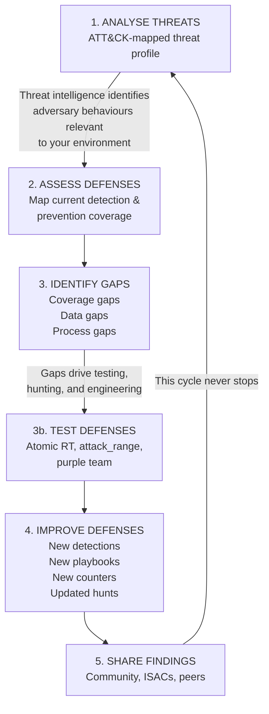
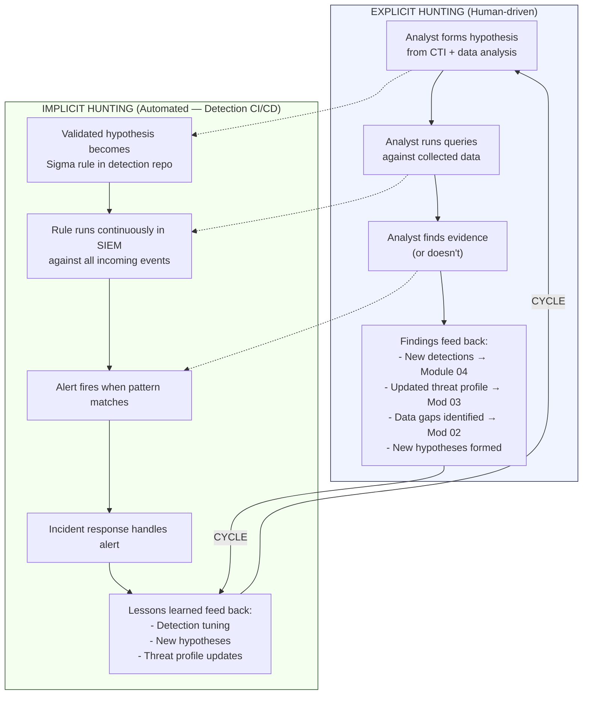
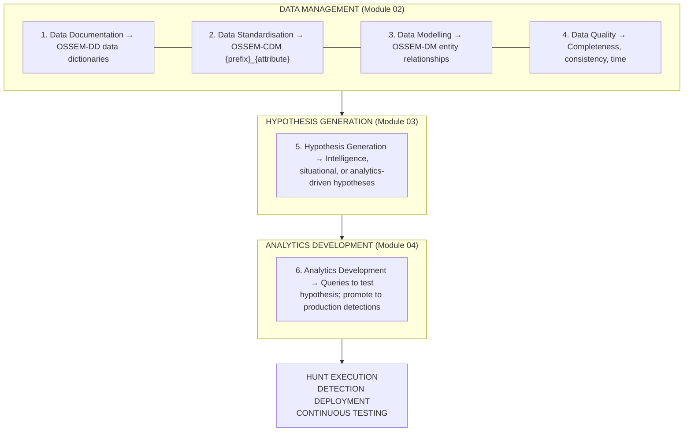
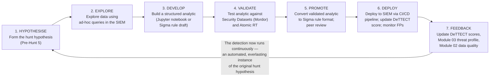
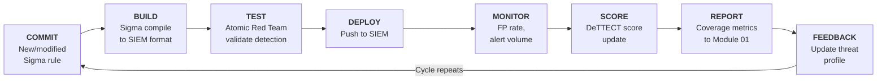
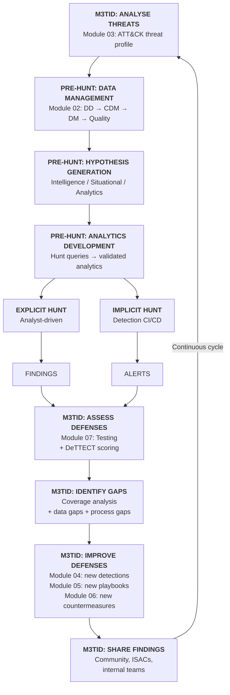

# M3TID & The Continuous Hunt

> **Core Philosophy:** Threat-informed defense is an everlasting baseline hunt with detection engineering CI/CD.

---

## What is M3TID?

**M3TID** — the Methodology for Threat-Informed Defense — is the structured approach developed by MITRE Engenuity's [Center for Threat-Informed Defense (CTID)](https://ctid.mitre-engenuity.org/) for applying threat intelligence to defensive operations. It operationalises the three pillars of threat-informed defense:

| Pillar | Description | Pipeline Implementation |
|---|---|---|
| **Cyber Threat Intelligence** | Understand adversary behaviour through ATT&CK-mapped intelligence | Module 03 (Threat Intelligence) |
| **Defensive Engagement** | Continuously test and validate defenses against realistic adversary behaviour | Module 07 (Detection Testing), Module 04 (Detection Engineering) |
| **Focused Sharing** | Collaborate with the community to collectively raise the bar | Module 01 (Governance — MITRE Strategy 9), external sharing |

### M3TID Cycle



---

## The Everlasting Baseline Hunt

### The Core Insight

Every detection rule running in your SIEM is a **codified hunt hypothesis executing continuously**. A Sigma rule that looks for `powershell.exe` spawned by `winword.exe` was once a threat hunter's hypothesis about adversary behaviour. Now it runs 24/7, hunting for that pattern in every event that flows through the SIEM.

This means:

- **Threat hunting and detection engineering are the same discipline at different stages of maturity**
- A hunt hypothesis that validates becomes a detection rule
- A detection rule that fires becomes an incident
- An incident that resolves feeds new hypotheses

The pipeline is not a sequence of one-time activities. It is **an everlasting hunt** — the threat landscape changes, your environment changes, your data changes, and your understanding deepens. The cycle never completes.



---

## Pre-Hunt Activities (Full Methodology)

The Threat Hunters Playbook defines six pre-hunt activities that must be established before any hunt can succeed. The first four (data management) are covered in Module 02. The remaining two (hypothesis generation and analytics development) bridge Modules 03 and 04.

### All Six Pre-Hunt Activities



---

## Pre-Hunt 5 — Hypothesis Generation

A hunt hypothesis is a testable statement about adversary behaviour in your environment. Without a hypothesis, a hunt is just a fishing expedition.

### Three Hypothesis Types

| Type | Source | Trigger | Example |
|---|---|---|---|
| **Intelligence-Driven** | CTI reports, ATT&CK group profiles, threat advisories, ISAC alerts | New threat group targets your sector; new technique published; incident at peer organisation | *"APT29 has been observed using T1059.001 with encoded PowerShell commands against organisations in our sector. If they target us, we should observe encoded PowerShell execution from abnormal parent processes."* |
| **Situational-Awareness-Driven** | Environmental knowledge, new data sources, infrastructure changes, anomalous baselines | New cloud environment deployed; new application onboarded; baseline deviation detected; vulnerability announced | *"We recently migrated to Azure AD. Adversaries targeting cloud environments use T1078.004 (Cloud Accounts). We should hunt for anomalous sign-in patterns from unfamiliar locations."* |
| **Analytics-Driven** | Data analysis, statistical baselines, ML anomaly outputs, stack counting | Unusual process frequency; new process names; statistical outlier in authentication patterns | *"Stack counting of parent-child process relationships reveals an unusual combination: outlook.exe → cmd.exe → certutil.exe. This matches T1105 (Ingress Tool Transfer) and warrants investigation."* |

### Hypothesis Format

Every hypothesis should be documented in a standard format:

```markdown
## Hunt Hypothesis: [ID]

### Hypothesis Statement
If [adversary / threat type] targets [asset / system] using [ATT&CK technique],
we should observe [specific data pattern] in [data source].

### Type
[Intelligence-Driven / Situational / Analytics-Driven]

### ATT&CK Mapping
- **Technique:** T[xxxx.xxx] — [Name]
- **Tactic:** [Tactic Name]
- **Data Sources:** [ATT&CK DS IDs]
- **Data Components:** [Specific components]

### Entity Relationships Required (OSSEM-DM)
| Source | Relationship | Target |
|---|---|---|
| Process | created | Process |
| Process | connected to | IP |

### Required Data (from Module 02)
- **Events:** [Sysmon 1, Security 4688, etc.]
- **CDM Fields:** [process_name, process_parent_name, process_command_line, etc.]
- **Data Quality Score:** [Current score from Module 02]
- **Hunt-Readiness:** [Ready / Not Ready — why]

### Analytics (initial queries)
[SQL / KQL / SPL queries to test the hypothesis]

### Expected Outcomes
- **If confirmed:** → Escalate to IR (Module 05); create detection rule (Module 04)
- **If not confirmed:** → Document negative finding; adjust hypothesis or data requirements
- **Either way:** → Update threat profile (Module 03); document findings

### Priority
[Critical / High / Medium / Low] — based on Module 03 threat profile priority

### Source
[CTI report link / Environmental trigger / Data analysis output]
```

### Hypothesis Backlog

Maintain a prioritised backlog of hunt hypotheses, sourced from:

| Source | Feeding Framework | How Hypotheses Are Generated |
|---|---|---|
| Module 03 threat profile | ATT&CK | Priority techniques without detection coverage → "Can we find evidence of T[xxxx] in our data?" |
| Module 04 DeTTECT gaps | DeTTECT | Low-scoring techniques → "Let's hunt for T[xxxx] to understand what the data looks like before writing a detection" |
| Module 05 incident findings | RE&CT Lessons Learned | Incident revealed technique not in profile → "Is this technique active elsewhere in our environment?" |
| Module 07 test results | Atomic Red Team | Technique that bypassed detection → "Can we find the bypass pattern in historical data?" |
| CTI feeds | External | New threat advisory → "Is this adversary already in our environment?" |
| Environmental changes | Internal | New system deployed → "What does the attack surface look like for this new asset?" |
| Data analysis | SIEM / notebooks | Statistical anomaly → "What is this unusual pattern — benign or malicious?" |

---

## Pre-Hunt 6 — Analytics Development

Analytics development bridges the gap between a hunt hypothesis and a production detection. It is the process of creating, testing, and refining the queries that test a hypothesis.

### The Analytics Maturity Spectrum

```
HUNT QUERY                VALIDATED ANALYTIC         PRODUCTION DETECTION
(one-time, manual)   →    (tested, documented)   →   (automated, CI/CD deployed)

Ad-hoc SQL in            Jupyter notebook with       Sigma rule in detection-
a SIEM search bar        documented logic,           as-code repo, validated
                         tested against Security     by Atomic RT, deployed
                         Datasets (Mordor),          via CI/CD to SIEM,
                         peer-reviewed               scored in DeTTECT
```

### Analytics Development Workflow



### From Hunt to Detection: The Promotion Criteria

A hunt analytic should be promoted to a production detection when:

| Criterion | Threshold | How to Verify |
|---|---|---|
| **True Positive Rate** | Fires on known-bad data (Security Datasets / Atomic RT) | Test against validation datasets |
| **False Positive Rate** | < 10% on production data baseline (2-week observation) | Run as alert-only (no action) for 2 weeks |
| **Data Dependency** | Required data sources scored ≥ 4 (Module 02 quality rubric) | Check data quality scorecards |
| **ATT&CK Mapping** | Mapped to specific technique and sub-technique | Verify in Sigma rule `tags` field |
| **Peer Review** | Reviewed by at least one other analyst/engineer | Code review in detection repo |
| **Documentation** | Hypothesis, logic, expected FPs, and tuning guidance documented | Sigma rule `description` + linked notebook |

---

## Detection Engineering CI/CD as Continuous Hunting

The detection-as-code CI/CD pipeline is the mechanism that transforms the continuous hunt into an automated, self-improving system.



> *Every detection deployed is a hunt hypothesis running permanently.*
> *Every test validates the hypothesis still works.*
> *Every alert is a hunt finding requiring triage.*
> *Every incident feeds new hypotheses.*
>
> ***THE CYCLE NEVER STOPS.***

---

## The Complete Continuous Hunt Cycle

Integrating M3TID, all six pre-hunt activities, detection engineering CI/CD, and incident response into a single continuous cycle:



---

## Operationalising the Continuous Hunt

### Hunt Cadence

| Activity | Frequency | Owner | Output |
|---|---|---|---|
| **Hypothesis generation** from CTI | Weekly | Threat Intel Analyst | New hypotheses added to backlog |
| **Hunt execution** (structured) | Weekly (1-2 hunts) | Threat Hunter | Hunt reports; new detection candidates |
| **Analytics development** (hunt → detection) | Per hunt finding | Detection Engineer | Sigma rules promoted to detection repo |
| **Detection validation** (Atomic RT) | Per new detection + weekly smoke | Detection Engineer / CI/CD | Test results updating DeTTECT |
| **Coverage assessment** (DeTTECT) | Monthly | Detection Engineer | Updated Navigator layers |
| **Purple team exercise** | Quarterly | Purple Team Lead | Full kill chain validation report |
| **Threat profile review** | Quarterly | Threat Intel Analyst | Updated composite threat profile |
| **SOC-CMM assessment** | Quarterly | SOC Manager | Maturity scores across all domains |
| **M3TID cycle review** | Quarterly | SOC Manager + Team | Full cycle effectiveness review |

### Metrics That Matter

| Metric | What It Measures | Target |
|---|---|---|
| **Hypotheses generated per month** | Intelligence-to-action conversion rate | ≥ 4 |
| **Hunt-to-detection conversion rate** | % of hunts that produce a new production detection | ≥ 30% |
| **Mean time from hypothesis to production detection** | Speed of the hunt-to-detection pipeline | < 2 sprints |
| **Detection coverage (DeTTECT)** | % of priority techniques with detection score ≥ 3 | ≥ 80% |
| **Detection validation pass rate** | % of detections that fire correctly on Atomic RT | ≥ 90% |
| **False positive rate** | Alerts that are not true positives | < 10% per rule |
| **MTTD (Mean Time to Detect)** | Time from technique execution to alert | < 5 minutes |
| **MTTR (Mean Time to Respond)** | Time from alert to containment | Trending down |
| **Data quality score** | Average quality across priority data sources | ≥ 4.0 |
| **SOC-CMM score** | Overall maturity across all domains | Trending up |

---

## Pipeline Modules as Continuous Hunt Stages

Reframing the seven pipeline modules through the lens of the continuous hunt:

| Pipeline Module | Continuous Hunt Role | What It Provides |
|---|---|---|
| **01 Governance** | **Hunt Authority** | Mandate, budget, staffing, and stakeholder support for continuous operations |
| **02 Data Documentation** | **Hunt Foundation** | The data management disciplines (DD, CDM, DM, Quality) that make data huntable |
| **03 Threat Intelligence** | **Hunt Direction** | CTI-driven hypothesis generation; threat profile that focuses the hunt |
| **04 Detection Engineering** | **Hunt Codification** | The pipeline that promotes validated hunt findings into permanent, automated detections |
| **05 Incident Response** | **Hunt Activation** | When an automated detection (codified hunt) fires, IR executes the response |
| **06 Countermeasures** | **Hunt Hardening** | For techniques that can't be hunted/detected reliably, countermeasures prevent them |
| **07 Detection Testing** | **Hunt Validation** | Continuous verification that codified hunts (detections) still work |

---

## References

- [MITRE Engenuity Center for Threat-Informed Defense](https://ctid.mitre-engenuity.org/)
- [Threat-Informed Defense — MITRE](https://www.mitre.org/focus-areas/threat-informed-defense)
- [Threat Hunters Playbook — Pre-Hunt Methodology](https://threathunterplaybook.com/pre-hunt/)
- [Threat Hunters Playbook — Data Management](https://threathunterplaybook.com/pre-hunt/data_management.html)
- [Ready to Hunt? First, Show Me Your Data! — Roberto Rodriguez](https://posts.specterops.io/ready-to-hunt-first-show-me-your-data-a642c6b170d6)
- [MITRE ATT&CK](https://attack.mitre.org/)
- [SOC-CMM](https://www.soc-cmm.com)
- [MITRE 11 Strategies of a World-Class SOC](https://www.mitre.org/sites/default/files/2022-04/11-strategies-of-a-world-class-cybersecurity-operations-center.pdf)
