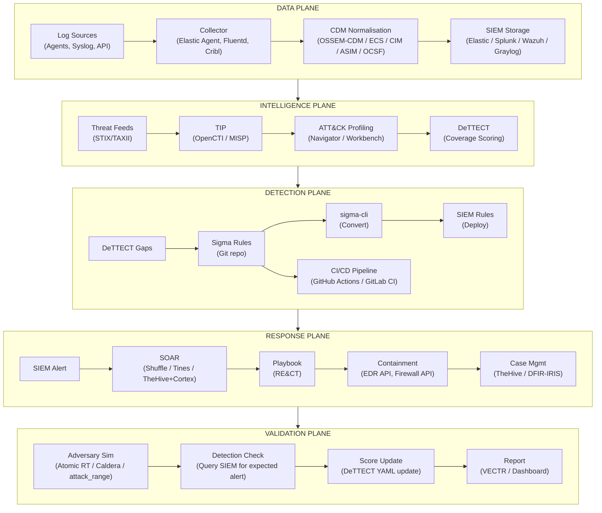

# Tool Options Matrix

> How to select tools for each pipeline capability — tool-agnostic, curated open-source options with selection criteria
>
> **Principle:** This pipeline specifies **capabilities**, not products. Every tool below can be replaced. What matters is that the capability exists and integrates into the pipeline.

---

## How to Use This Matrix

1. **Identify the capability you need** from the tables below
2. **Review the curated options** — all are open-source or free-tier unless noted
3. **Use the selection criteria** to match tools to your environment
4. **Validate integration** with adjacent pipeline modules before committing

### Selection Criteria Key

| Criterion | Scale | Description |
|---|---|---|
| **Deploy Complexity** | Low / Med / High | Effort to install, configure, and operationalise |
| **Scale Fit** | S / M / L / XL | Small (<50 endpoints), Medium (<500), Large (<5000), XL (5000+) |
| **SIEM Integration** | Native / API / Manual | How easily tool output reaches your SIEM |
| **Cost** | Free / Freemium / Commercial | Licensing model (focus on OSS/free options) |
| **Community** | Active / Moderate / Limited | Community size, update frequency, documentation quality |

---

## Module 02 — Data Documentation

### Log Collection & Forwarding

| Tool | Deploy | Scale | SIEM Integration | Cost | Community | Choose This If... |
|---|---|---|---|---|---|---|
| **Elastic Agent / Filebeat** | Med | S-XL | Native (Elastic) | Free | Active | You run Elastic stack or need lightweight cross-platform collection |
| **Fluentd / Fluent Bit** | Med | M-XL | API (any SIEM) | Free | Active | You need a vendor-neutral, pluggable log pipeline with 500+ connectors |
| **Cribl Stream** | Med | M-XL | API (any SIEM) | Freemium | Active | You need log routing, filtering, enrichment before SIEM ingestion |
| **NXLog Community** | Low | S-L | API (any SIEM) | Free | Moderate | You need Windows Event Log collection with minimal footprint |
| **rsyslog / syslog-ng** | Low | S-XL | Native (syslog-based SIEMs) | Free | Active | You need high-performance syslog collection on Linux |

### Common Data Model (CDM) / Normalisation

| Framework | Deploy | Scale | SIEM Integration | Cost | Community | Choose This If... |
|---|---|---|---|---|---|---|
| **OSSEM-CDM** | Low | Any | Manual (you build mappings) | Free | Moderate | You want the most ATT&CK-aligned CDM with entity-based naming |
| **Elastic Common Schema (ECS)** | Low | Any | Native (Elastic) | Free | Active | You run Elastic stack — ECS is built-in |
| **Splunk CIM** | Low | Any | Native (Splunk) | Freemium | Active | You run Splunk — CIM is the native normalisation layer |
| **Microsoft ASIM** | Low | Any | Native (Sentinel) | Freemium | Active | You run Microsoft Sentinel — ASIM is native |
| **OCSF** (Open Cybersecurity Schema) | Low | Any | API (growing adoption) | Free | Active | You want the newest vendor-backed open schema (AWS + Splunk + IBM led) |

### SIEM / Log Storage & Search

| Tool | Deploy | Scale | Cost | Community | Choose This If... |
|---|---|---|---|---|---|
| **Elastic Security (ELK)** | High | M-XL | Free / Paid tiers | Active | You want open-source SIEM with strong detection and ML capabilities |
| **Wazuh** | Med | S-L | Free | Active | You want open-source SIEM + EDR + compliance in one stack |
| **Graylog** | Med | S-L | Free / Paid tiers | Active | You want open-source log management with simple deployment |
| **Apache Kafka + ClickHouse** | High | L-XL | Free | Active | You need high-throughput log streaming with columnar storage at massive scale |
| **Splunk** | High | M-XL | Commercial | Active | Budget permits commercial SIEM; largest detection content ecosystem |
| **Microsoft Sentinel** | Med | M-XL | Consumption-based | Active | You are Azure-native; want cloud-native SIEM with KQL |
| **Google Chronicle / SecOps** | Med | L-XL | Consumption-based | Active | You want Google-scale search with UDM normalisation built-in |

---

## Module 03 — Threat Intelligence

### CTI Platform / Threat Intelligence Platform (TIP)

| Tool | Deploy | Scale | SIEM Integration | Cost | Community | Choose This If... |
|---|---|---|---|---|---|---|
| **OpenCTI** | High | M-XL | API (STIX/TAXII) | Free | Active | You want the most feature-rich OSS TIP with STIX native and ATT&CK integration |
| **MISP** | Med | S-XL | API + Splunk/Elastic plugins | Free | Active | You want mature, widely-adopted OSS TIP with strong community sharing |
| **YETI** | Low | S-M | API | Free | Moderate | You want lightweight threat intel management for a smaller team |
| **Hive (TheHive)** | Med | S-L | API | Free | Active | You want combined TIP + case management (pair with Cortex for enrichment) |

### ATT&CK Navigator & Visualisation

| Tool | Deploy | Scale | Cost | Community | Choose This If... |
|---|---|---|---|---|---|
| **ATT&CK Navigator** (MITRE) | Low | Any | Free | Active | You want the standard ATT&CK layer visualisation (web or local) |
| **DeTTECT** | Low | Any | Free | Active | You want coverage scoring + Navigator layer generation from YAML |
| **ATT&CK Workbench** | Med | Any | Free | Active | You want to customise ATT&CK with local additions for your threat model |
| **VECTR** | Med | M-L | Free | Active | You want purple team tracking with ATT&CK mapping and campaign management |

### STIX/TAXII & Indicator Sharing

| Tool | Deploy | Scale | Cost | Community | Choose This If... |
|---|---|---|---|---|---|
| **OpenCTI** (built-in TAXII) | High | M-XL | Free | Active | You already run OpenCTI — TAXII server is integrated |
| **MISP** (built-in sharing) | Med | S-XL | Free | Active | You want peer-to-peer sharing with ISAC communities |
| **Medallion** (OASIS reference) | Low | S-M | Free | Limited | You need a minimal TAXII 2.1 server implementation |
| **Cabby** (TAXII client) | Low | Any | Free | Limited | You need a TAXII client library for Python automation |

---

## Module 04 — Detection Engineering

### Detection Coverage Scoring

| Tool | Deploy | Scale | SIEM Integration | Cost | Community | Choose This If... |
|---|---|---|---|---|---|---|
| **DeTTECT** | Low | Any | Manual (YAML-driven) | Free | Active | You want the standard ATT&CK coverage scoring with data source + detection quality |
| **VECTR** | Med | M-L | API | Free | Active | You want purple team campaign tracking with detection scoring per engagement |
| **ATT&CK Navigator** | Low | Any | Manual | Free | Active | You want simple visual heatmap overlays without scoring automation |

### Detection Rule Management / Detection-as-Code

| Tool | Deploy | Scale | SIEM Integration | Cost | Community | Choose This If... |
|---|---|---|---|---|---|---|
| **Sigma** + **sigma-cli** | Low | Any | Converts to any SIEM | Free | Active | You want vendor-neutral detection rules that compile to any SIEM query language |
| **Elastic Detection Rules** | Low | M-XL | Native (Elastic) | Free | Active | You run Elastic and want their curated TOML-based rule format |
| **Splunk Security Content** (ESCU) | Low | M-XL | Native (Splunk) | Free | Active | You run Splunk and want Splunk's curated detection content |
| **Panther Analysis** | Med | M-L | Native (Panther) | Freemium | Moderate | You run Panther SIEM and want Python-based detections |

### Sigma Rule Conversion

| Tool | Deploy | Scale | Cost | Community | Choose This If... |
|---|---|---|---|---|---|
| **sigma-cli** (pySigma) | Low | Any | Free | Active | Standard Sigma conversion — supports Splunk, Elastic, Sentinel, Chronicle, etc. |
| **Uncoder.IO** | Low | Any | Free (web) | Active | You want a web UI for ad-hoc Sigma conversion and translation |
| **SigConverter** | Low | Any | Free | Moderate | You want a self-hosted Sigma conversion service |

### SIEM Detection / Rule Engine

| Tool | Deploy | Scale | Cost | Community | Choose This If... |
|---|---|---|---|---|---|
| **Elastic SIEM Rules** | Med | M-XL | Free / Paid tiers | Active | EQL + KQL correlation, ML-based anomaly detection |
| **Splunk Enterprise Security** | High | M-XL | Commercial | Active | Largest detection content ecosystem; SPL correlation searches |
| **Wazuh Rules** | Low | S-L | Free | Active | XML-based rule engine with active response integration |
| **Suricata** (IDS/IPS) | Med | M-XL | API (any SIEM) | Free | Active | Network-layer detection rules (ET rules, custom rules) |

---

## Module 05 — Incident Response

### SOAR / Playbook Automation

| Tool | Deploy | Scale | SIEM Integration | Cost | Community | Choose This If... |
|---|---|---|---|---|---|---|
| **Shuffle** | Med | S-L | API (any SIEM) | Free | Active | You want open-source SOAR with visual workflow builder and 1000+ app integrations |
| **TheHive + Cortex** | Med | S-L | API | Free | Active | You want case management + automated enrichment/response in one stack |
| **n8n** | Med | S-M | API | Free | Active | You want general-purpose workflow automation adaptable to security playbooks |
| **Tines** | Low | M-XL | API | Freemium | Active | Budget permits; you want low-code SOAR with strong community edition |
| **XSOAR (Cortex)** | High | L-XL | Native (Palo Alto) | Commercial | Active | Budget permits commercial SOAR; largest integration marketplace |

### Case Management & Ticketing

| Tool | Deploy | Scale | SIEM Integration | Cost | Community | Choose This If... |
|---|---|---|---|---|---|---|
| **TheHive** | Med | S-L | API | Free | Active | You want security-focused case management with alert intake and observables |
| **DFIR-IRIS** | Med | S-M | API | Free | Active | You want forensic case management with timeline and evidence tracking |
| **RTIR** (Request Tracker for IR) | Med | S-M | API | Free | Moderate | You want mature incident tracking built on RT |
| **ServiceNow SecOps** | High | L-XL | Native | Commercial | Active | Enterprise scale; you already run ServiceNow |

---

## Module 06 — Countermeasures

### Vulnerability Management & Scanning

| Tool | Deploy | Scale | SIEM Integration | Cost | Community | Choose This If... |
|---|---|---|---|---|---|---|
| **OpenVAS / Greenbone** | Med | S-L | API | Free | Active | You want open-source vulnerability scanning with active community |
| **Nuclei** | Low | S-XL | API | Free | Active | You want fast, template-based vulnerability scanning with 8000+ community templates |
| **Wazuh** (vulnerability detection) | Low | S-L | Native | Free | Active | You already run Wazuh — SCA and vulnerability detection are built-in |

### Configuration Hardening & Compliance

| Tool | Deploy | Scale | Cost | Community | Choose This If... |
|---|---|---|---|---|---|
| **CIS-CAT Lite** | Low | S-M | Free | Active | You want CIS Benchmark scanning for compliance assessment |
| **OpenSCAP** | Low | S-L | Free | Active | You want SCAP-based compliance checking on Linux systems |
| **Wazuh SCA** | Low | S-L | Free | Active | You already run Wazuh — Security Configuration Assessment is built-in |
| **Ansible + CIS Roles** | Med | M-XL | Free | Active | You want automated hardening deployment at scale |

### Deception & Active Defence

| Tool | Deploy | Scale | Cost | Community | Choose This If... |
|---|---|---|---|---|---|
| **Canarytokens** | Low | Any | Free | Active | You want zero-effort tripwire tokens (DNS, web, file, AWS keys, email) |
| **OpenCanary** | Low | S-M | Free | Active | You want lightweight honeypot services (SSH, SMB, RDP, HTTP, MSSQL) |
| **HoneyDB / T-Pot** | Med | S-M | Free | Moderate | You want a multi-honeypot platform with threat data collection |
| **Thinkst Canary** | Low | M-XL | Commercial | Active | Budget permits; you want enterprise-grade deception with near-zero FP |

---

## Module 07 — Detection Testing

### Adversary Simulation / Emulation

| Tool | Deploy | Scale | SIEM Integration | Cost | Community | Choose This If... |
|---|---|---|---|---|---|---|
| **Atomic Red Team** | Low | Any | Manual (validate in SIEM) | Free | Active | You want the standard per-technique atomic tests mapped to ATT&CK |
| **atomic-operator** (Python) | Low | Any | Manual | Free | Active | You want cross-platform Atomic RT execution from Python |
| **Caldera** (MITRE) | Med | S-L | API | Free | Active | You want automated multi-step adversary emulation with ATT&CK mapping |
| **Infection Monkey** | Med | S-M | API | Free | Active | You want automated lateral movement and exploitation simulation |
| **Stratus Red Team** | Low | Cloud | Manual | Free | Active | You specifically need cloud (AWS/Azure/GCP) attack simulation |

### Detection Validation & Purple Teaming

| Tool | Deploy | Scale | Cost | Community | Choose This If... |
|---|---|---|---|---|---|
| **Atomic Red Team** + DeTTECT | Low | Any | Free | Active | You want simple test → score loop with ATT&CK coverage tracking |
| **VECTR** | Med | M-L | Free | Active | You want structured purple team campaign management with metrics |
| **Caldera** | Med | S-L | Free | Active | You want automated adversary emulation with pluggable abilities |
| **attack_range** (Splunk) | High | S-M | Free | Active | You want full lab provisioning (Windows domain, Splunk, Kali) for scenario testing |
| **DetectionLab** | High | S-M | Free | Moderate | You want a pre-built lab (Windows domain + logging) for detection development |

### Purple Team Automation

| Tool | Deploy | Scale | Cost | Community | Choose This If... |
|---|---|---|---|---|---|
| **Caldera** | Med | S-L | Free | Active | You want agent-based automated adversary emulation with campaign planning |
| **VECTR** | Med | M-L | Free | Active | You want campaign tracking, metrics, and reporting for purple team exercises |
| **Prelude Operator** | Low | S-M | Freemium | Moderate | You want lightweight adversary emulation with community tests |

---

## Module 08 — Forensics & DFIR

### Forensic Acquisition

| Tool | Deploy | Scale | Cost | Community | Choose This If... |
|---|---|---|---|---|---|
| **Velociraptor** | Med | M-XL | Free | Active | You need enterprise-scale remote triage and live acquisition |
| **GRR Rapid Response** | Med | M-XL | Free | Active | You need Google-style fleet-wide live forensics |
| **AVML** | Low | S-L | Free | Active | You need Linux/cloud VM memory acquisition |
| **LiME** | Low | S-L | Free | Active | You need Linux kernel-level memory acquisition |
| **dc3dd** | Low | S-M | Free | Active | You need bit-for-bit disk imaging with hash verification |
| **CyLR** | Low | S-M | Free | Moderate | You need lightweight triage collection (no full image) |

### Memory Forensics

| Tool | Deploy | Scale | Cost | Community | Choose This If... |
|---|---|---|---|---|---|
| **Volatility 3** | Low | Any | Free | Active | You want the standard open-source memory analysis framework |
| **MemProcFS** | Low | Any | Free | Active | You want rapid memory triage via virtual file system mount |
| **Rekall** | Low | Any | Free | Moderate | You want an alternative memory framework with scripting focus |

### Disk Forensics & Analysis

| Tool | Deploy | Scale | Cost | Community | Choose This If... |
|---|---|---|---|---|---|
| **Autopsy / Sleuth Kit** | Low | Any | Free | Active | You want a full-featured open-source disk forensic workbench |
| **DFIR-IRIS** | Med | S-M | Free | Active | You want collaborative forensic case management and analysis |
| **Plaso / log2timeline** | Low | Any | Free | Active | You want super-timeline generation from multiple artefact sources |
| **Timesketch** | Med | S-L | Free | Active | You want collaborative timeline analysis and annotation |

### Artefact Parsing

| Tool | Deploy | Scale | Cost | Community | Choose This If... |
|---|---|---|---|---|---|
| **Eric Zimmerman Tools** | Low | Any | Free | Active | You want the standard Windows artefact parsing toolkit |
| **Hayabusa** | Low | Any | Free | Active | You want Sigma-based Windows Event Log triage |
| **Chainsaw** | Low | Any | Free | Active | You want fast EVTX triage with detection rules |
| **Velociraptor** | Med | M-XL | Free | Active | You want remote artefact collection and parsing at enterprise scale |
| **KAPE** | Low | Any | Free | Active | You want modular Windows artefact collection and processing |

---

## Cross-Module Infrastructure

### Identity & Access Management (for SOC tools)

| Tool | Deploy | Scale | Cost | Community | Choose This If... |
|---|---|---|---|---|---|
| **Keycloak** | Med | M-XL | Free | Active | You want SSO/SAML/OIDC for all SOC tools with one identity provider |
| **Authentik** | Med | S-L | Free | Active | You want lightweight identity provider with modern UI |

### Workflow & Integration

| Tool | Deploy | Scale | Cost | Community | Choose This If... |
|---|---|---|---|---|---|
| **n8n** | Med | S-M | Free | Active | You want visual workflow automation connecting SOC tools |
| **Shuffle** | Med | S-L | Free | Active | You want security-focused workflow automation (SOAR-lite) |
| **Apache Airflow** | High | M-XL | Free | Active | You want enterprise-grade workflow orchestration for data pipelines |

### Communication & Collaboration

| Tool | Deploy | Scale | Cost | Community | Choose This If... |
|---|---|---|---|---|---|
| **Mattermost** | Med | S-L | Free | Active | You want self-hosted Slack alternative with security integrations |
| **Rocket.Chat** | Med | S-L | Free | Active | You want self-hosted chat with chatbot/integration framework |
| **Matrix (Element)** | Med | S-L | Free | Active | You want federated, end-to-end encrypted communication |

---

## Integration Architecture

---

## Starter Stacks

Curated tool combinations for common starting points. These are **starting points, not prescriptions** — substitute any component based on your environment.

### Minimal Stack (Small SOC, Low Budget)

| Capability | Tool | Why |
|---|---|---|
| SIEM + EDR | **Wazuh** | All-in-one: log collection, detection rules, EDR, compliance — single platform |
| CDM | **OSSEM-CDM** (manual) | Framework reference for normalisation |
| TIP | **MISP** | Mature, lightweight, strong community sharing |
| Detection Rules | **Sigma** + sigma-cli | Vendor-neutral, converts to Wazuh rules |
| Coverage Scoring | **DeTTECT** | YAML-driven, no infrastructure needed |
| Testing | **Atomic Red Team** | Lightweight per-technique testing |
| Case Management | **TheHive** | Security-focused, integrates with MISP |
| Forensics | **Velociraptor** | Triage + collection + parsing in one tool |

### Standard Stack (Medium SOC)

| Capability | Tool | Why |
|---|---|---|
| Log Collection | **Elastic Agent** | Unified collection for Elastic stack |
| SIEM | **Elastic Security** | Strong detection engine, ML capabilities, free tier |
| CDM | **ECS** (Elastic Common Schema) | Native to Elastic stack |
| TIP | **OpenCTI** | Feature-rich, STIX-native, ATT&CK integration |
| Detection Rules | **Sigma** → Elastic via sigma-cli | Vendor-neutral rules deployed to Elastic |
| Coverage Scoring | **DeTTECT** + Navigator | Visual coverage with scoring |
| SOAR | **Shuffle** or **TheHive + Cortex** | Workflow automation + enrichment |
| Testing | **Atomic RT** + **Caldera** | Unit tests + multi-step emulation |
| Case Management | **TheHive** | Integrated with Cortex enrichment |
| Forensics | **Velociraptor** + **Autopsy** + **Timesketch** | Fleet triage + deep analysis + collaborative timeline |

### Enterprise Stack (Large SOC)

| Capability | Tool | Why |
|---|---|---|
| Log Pipeline | **Cribl Stream** → SIEM | Route, filter, enrich before SIEM ingestion |
| SIEM | **Splunk** or **Elastic Security** (paid) | Scale, performance, mature detection ecosystems |
| CDM | **Splunk CIM** or **ECS** | Native to chosen SIEM platform |
| TIP | **OpenCTI** | Scales to large intel operations |
| Detection Rules | **Sigma** + SIEM-native content | Sigma for portability + vendor content for depth |
| Coverage | **DeTTECT** + **VECTR** | Scoring + purple team campaign management |
| SOAR | **Shuffle** or commercial (XSOAR/Tines) | Automation at scale |
| Testing | **Caldera** + **attack_range** | Automated emulation + full lab scenarios |
| Purple Team | **VECTR** + **Caldera** | Campaign tracking + automated emulation |
| Case Management | **TheHive** or **ServiceNow SecOps** | Security-focused or enterprise ITSM integration |
| Forensics | **Velociraptor** + **DFIR-IRIS** + **Plaso** + **Timesketch** | Fleet-scale acquisition + case management + timeline |

---

## Pairwise Integration Details

### ATT&CK ↔ OSSEM (DD + CDM + DM)

| Integration Point | Direction | Mechanism |
|---|---|---|
| Data Sources | ATT&CK → OSSEM-DD | ATT&CK Data Sources (DS) specify what telemetry is needed; OSSEM-DD provides per-event field documentation |
| Data Components | ATT&CK → OSSEM-DM | ATT&CK Data Components (e.g., "Process Creation") map to OSSEM-DM entity relationships (e.g., `Process created Process`) |
| Field Normalisation | OSSEM-CDM → Analytics | OSSEM-CDM `{prefix}_{attribute}` naming convention provides standardised field names for all detection queries |
| Entity Relationships | OSSEM-DM → ATT&CK | OSSEM-DM relationship definitions were adopted into ATT&CK as the Data Component concept |
| Technique Coverage | OSSEM-DM → ATT&CK | `techniques_to_events_mapping.yaml` traces each ATT&CK technique through Data Source → Data Component → Relationship → Security Event |

### ATT&CK ↔ DeTTECT

| Integration Point | Direction | Mechanism |
|---|---|---|
| Technique IDs | ATT&CK → DeTTECT | DeTTECT YAML files reference ATT&CK technique IDs |
| Group Definitions | ATT&CK → DeTTECT | DeTTECT imports ATT&CK group technique lists for overlay analysis |
| Data Source Mapping | ATT&CK → DeTTECT | DeTTECT data_sources.yaml maps to ATT&CK data source framework |
| Navigator Layers | DeTTECT → ATT&CK Navigator | DeTTECT outputs .json layers viewable in ATT&CK Navigator |

### ATT&CK ↔ Sigma → SIEM

| Integration Point | Direction | Mechanism |
|---|---|---|
| Technique Tags | ATT&CK → Sigma | Sigma rules carry `attack.tXXXX.XXX` tags mapping to ATT&CK |
| Detection Logic | Sigma → sigma-cli → SIEM | sigma-cli compiles Sigma to SPL, KQL, Lucene, etc. |
| CAR Analytics | CAR → Sigma | Many CAR analytics ship with Sigma rule implementations |

### ATT&CK ↔ Atomic Red Team ↔ DeTTECT

| Integration Point | Direction | Mechanism |
|---|---|---|
| Technique IDs | ATT&CK → Atomic RT | Atomic tests organised by ATT&CK technique ID |
| Test Execution | Atomic RT → SIEM Validation | Run atomic test → check SIEM for expected alert |
| Score Validation | Atomic RT → DeTTECT | Test pass/fail updates DeTTECT detection scores |
| Continuous Loop | Bidirectional | Test → Score → Improve → Re-test |

### SOC-CMM ↔ All Pipeline Modules

| Integration Point | Direction | Mechanism |
|---|---|---|
| Maturity Assessment | SOC-CMM → All modules | Five-domain assessment identifies gaps across the entire pipeline |
| Improvement Prioritisation | SOC-CMM → Roadmap | Domain scores determine which pipeline modules need investment |
| Service Evaluation | SOC-CMM Services → Modules 03-08 | Services domain aspects map directly to pipeline module outputs |
| People Evaluation | SOC-CMM People → Workforce Roles | People domain aspects map to DoDCWF/ASD/CIISec three-framework assessment |
| Quarterly Review | SOC-CMM ↔ All modules | SOC-CMM assessment drives quarterly maturity review and sprint planning |

### M3TID ↔ Pipeline Modules

| Integration Point | Direction | Mechanism |
|---|---|---|
| Analyse Threats | M3TID → Module 03 | CTI-driven threat profiling produces ATT&CK-mapped composite threat profile |
| Assess Defenses | M3TID → Modules 04, 07 | DeTTECT coverage scoring and Atomic RT validation assess defensive posture |
| Identify Gaps | M3TID → Modules 02, 04, 06 | Coverage gaps, data gaps, and process gaps identified |
| Improve Defenses | M3TID → Modules 04, 05, 06 | New detections, playbooks, and countermeasures deployed to close gaps |
| Share Findings | M3TID → External | Community sharing via ISACs, peer collaboration, open-source contributions |
| Continuous Hunt | M3TID → All modules | Everlasting baseline hunt — explicit (analyst) and implicit (automated detections) |

---

## Data Flow Summary

| From | To | What Flows |
|---|---|---|
| NIST CSF 2.0 | All modules | Governance categories, risk context, authority |
| ASD CSF / DoDCWF / CIISec | Module 01, Workforce | Roles, skill requirements, specialism depth |
| OSSEM-DD | Module 02 | Per-event field documentation (data dictionaries) |
| OSSEM-CDM | Modules 02, 04 | Normalised field names, schema tables for SIEM parsing |
| OSSEM-DM | Modules 02, 03, 04, 05 | Entity relationships, ATT&CK data component mappings |
| ATT&CK | Modules 03-08 | Technique IDs, group profiles, data sources, data components |
| Threat Hunters Playbook | Modules 02, 04 | Data management disciplines, hunt hypotheses, analytics templates |
| Security Datasets | Modules 02, 07 | Pre-recorded security events for CDM validation and detection testing |
| DeTTECT | Modules 04, 06, 07 | Coverage scores, gap analysis, Navigator layers |
| MITRE CAR | Module 04 | Pre-built analytics, query templates |
| Atomic Red Team | Modules 04, 07 | Test procedures, validation results |
| Caldera | Modules 07, 08 | Multi-step adversary emulation, campaign results |
| attack_range | Module 07 | Lab infrastructure, scenario simulation, Splunk data |
| RE&CT | Module 05 | Response action taxonomy, playbook structure |
| D3FEND | Module 06 | Defensive technique mappings, countermeasure specifications |
| Forensic Tools | Module 08 | Evidence, artefacts, timelines, IoCs |
| SOC-CMM | All modules | Five-domain maturity assessment; improvement prioritisation |
| M3TID / THP | Modules 02, 03, 04 | Continuous hunt cycle; pre-hunt activities; hypothesis generation |

---

## Toolchain Installation Summary

| Tool | Install Method | Primary Use |
|---|---|---|
| DeTTECT | `pip install DeTTECT` | Coverage scoring and gap analysis |
| Sigma CLI | `pip install sigma-cli` | Detection-as-code conversion |
| Atomic Red Team (PS) | `Install-Module invoke-atomicredteam` | Windows technique testing |
| atomic-operator (Python) | `pip install atomic-operator` | Cross-platform technique testing |
| Caldera | `git clone` + `pip install` | Automated adversary emulation |
| attack_range | `git clone` + `pip install -r requirements.txt` | Full lab provisioning |
| ATT&CK Navigator | Web-based or `git clone` | Technique visualisation |
| VECTR | Docker Compose | Purple team campaign management |
| OpenCTI | Docker Compose | Threat intelligence platform |
| MISP | Docker / VM image | Threat intelligence sharing |
| TheHive + Cortex | Docker Compose | Case management + enrichment |
| Shuffle | Docker Compose | SOAR / workflow automation |
| DFIR-IRIS | Docker Compose | Forensic case management |
| Velociraptor | Binary / MSI / Docker | Enterprise forensic triage |
| Volatility 3 | `pip install volatility3` | Memory forensics |
| Autopsy | Installer (Windows/Linux) | Disk forensics |
| Plaso | `pip install plaso` | Super-timeline generation |
| Timesketch | Docker Compose | Collaborative timeline analysis |
| Hayabusa | Binary download | Windows Event Log triage |
| Chainsaw | Binary download | EVTX triage with detection rules |
| Wazuh | Docker / packages / OVA | SIEM + EDR + compliance |
| Elastic Security | Docker / packages / Cloud | SIEM + detection + ML |
| OpenVAS / Greenbone | Docker Compose | Vulnerability scanning |
| Nuclei | `go install` / binary | Template-based vulnerability scanning |

---

## References

- [OSSEM](https://github.com/OTRF/OSSEM) (DD, CDM, DM sub-projects)
- [Threat Hunters Playbook](https://github.com/OTRF/ThreatHunter-Playbook)
- [MITRE ATT&CK](https://attack.mitre.org/)
- [DeTTECT](https://github.com/rabobank-cdc/DeTTECT)
- [MITRE CAR](https://car.mitre.org/)
- [Sigma Rules](https://github.com/SigmaHQ/sigma)
- [Atomic Red Team](https://github.com/redcanaryco/atomic-red-team)
- [Caldera](https://github.com/mitre/caldera)
- [VECTR](https://github.com/SecurityRiskAdvisors/VECTR)
- [RE&CT](https://github.com/atc-project/atc-react)
- [D3FEND](https://d3fend.mitre.org/)
- [OpenCTI](https://github.com/OpenCTI-Platform/opencti)
- [MISP](https://github.com/MISP/MISP)
- [TheHive](https://github.com/TheHive-Project/TheHive)
- [Shuffle](https://github.com/Shuffle/Shuffle)
- [Velociraptor](https://docs.velociraptor.app/)
- [Wazuh](https://wazuh.com/)
- [Elastic Security](https://www.elastic.co/security)
- [SOC-CMM](https://www.soc-cmm.com)
